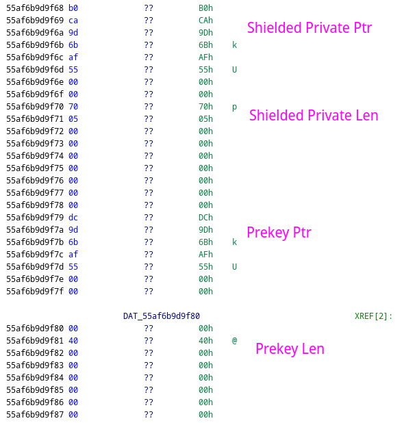

# Task 5

## Description

The FBI knew who that was, and got a warrant to seize their laptop. It looks like they had an encrypted file, which may be of use to your investigation.

We believe that the attacker may have been clever and used the same RSA key that they use for SSH to encrypt the file. We asked the FBI to take a core dump of `ssh-agent` that was running on the attacker's computer.

Extract the attacker's private key from the core dump, and use it to decrypt the file.

Hint: if you have the private key in PEM format, you should be able to decrypt the file with the command `openssl pkeyutl -decrypt -inkey privatekey.pem -in data.enc`

## Solution

The challenge provides three files. 

1. `ssh-agent` - SSH Agent binary used for storing SSH keys and certificates.
2. `core` - Core dump SSH Agent containing the private key of the attacker in memory.
3. `data.enc` - Encrypted message that needs to be decrypted with the extracted private key.

The core dump can be both statically and dynamically analyzed using GDB or Ghidra. Because I had never reversed a core dump before, I started by researching how I would recover the private key from a core dump of SSH-Agent and came across this article:

[](https://security.humanativaspa.it/openssh-ssh-agent-shielded-private-key-extraction-x86_64-linux/)

The article walks through how the private key is stored in memory and how to find it. 

The beginning of the article displays a screenshot of the OpenSSH source code. To get a better idea of how ssh-agent works, I pulled the source code and started looking through it.

The screenshots in the article show that the ssh key and prekey are stored in an `sshkey` struct. The sshkey struct is then used in the `identity` struct. 


The identity struct is then used in the `idtable` struct which stores a linked list of identities. The `idtable` is instantiated as an uninitialized global variable which means it can be found in the `.bss` section.


The problem with finding where `idtable` is located in the `.bss` section is that PIE is enabled on the `ssh-agent` binary, meaning that the address of `idtable` in the core file will not be the same as the `idtable` address in the static binary. To find the offset, I would need to figure out the PIE offset and use that to find idtable in the core file. Because the process was run on Ubuntu 20.04 as described in the challenge description, I had to spin up a docker container to do the dynamic analysis.

Using gdb it is possible to see the call stack up to where the program was crashed. Stack frame #2 shows `__libc_start_main`, which is followed immediately by an unnamed location in from #1. It can be reasonably assumed that this is the `main` function.


Disassembling the instruction pointer at this address shows some instructions being executed which are presumably inside `main`. The addresses here are the run time addresses that need to be compared to the static addresses to determine the PIE offset. Using this information and the presumption that the asm is in `main` it is trivial to find the static address in Ghidra.<br>
Note: the reason why I call `x/32i $rip-5` instead of `x/32i $rip` is because RIP is pointing to the address after the active call function call which happens to be 5 bytes in size.


From the disassembly it can be seen that is program is calling `poll` before having a call to `__errno_location`. These two functions can be used to find the corrosponding static addresses in the ssh-agent binary. To find this address statically the `ssh-agent` binary must be loaded in ghidra. Because symbols are stripped, it is impossible to just jump to main, so it will need to be found but checking the program's entrypoint and seeing the first function called.


After the main function is located the call to `poll` and `__errno_location` can be found by searching either the listing window or the decompiler window.


Now all that is left is to find the PIE offset using the static and dynamic addresses.

```
Poll function call:
Static = 0x88cc
Dynamic = 0x55af6a28f8cc

Offset = Dynamic - Static
       = 0x55af6a28f8cc - 0x88cc
       = 0x55af6a287000
```

The PIE offset can now be used to find the dynamic address of any static item in the binary, including `idtab`. To find `idtab` in the core file, the function call to `idtab_init` must be found in `main`.


The reason this function is known to be `idtab_init` is because it preceeds a function called `ssh_signal` that is called 4 times.


The pointer returned from `idtab_init` is loaded into `DAT_000567c0`. The value 0x000567c0 is the static address in `.bss` where `idtab` is initialized to.

The dynamic address for `idtab` can now be calculated using the PIE offset found earlier.

```
Static = 0x000567c0
Offset = 0x55af6a287000
Dynamic = Static + Offset
        = 0x55af6a2dd7c0
```


The pointer above is pointing to 0x55af6b9d63c0, which is the `idtab`. This is confirmed by the structure of the memory matching the struct as it is defined in the source code.


The second value in the `idtab` is the head of the identity linked list and points to the `identity`, which is holding the desired `sshkey` struct.


Inside the `identity` struct, the `next` pointer, `sshkey` pointer, and `comment` string are listed successfully in memory. Following the second pointer leads to the desired `sshkey` struct.


Following the data structure down the heap eventually shows the last four values in the struct: `shielded_private`, `shielded_len`, `shield_prekey`, `shield_prekey_len`.



Now that the locations and lengths of the necessary data are known, they can be extracted in gdb using `dump memory`.


The final step is to decrypt the RSA key either using python or gdb with ssh-keygen. I used the same process listed in the original article, using gdb with ssh-keygen to decrypt the RSA key.

```bash
$ tar xvfz openssh-8.6p1.tar.gz
$ cd openssh-8.6p1
$ ./configure --with-audit=debug
$ make ssh-keygen
$ gdb ./ssh-keygen
```

The following gdb script can be used to decrypt the private key and place it in a file.

```
b main
b sshkey_free
r
set $miak = (struct sshkey *)sshkey_new(0)
set $shielded_private = (unsigned char *)malloc(1392)
set $shield_prekey = (unsigned char *)malloc(16384)
set $fd = (FILE*)fopen("./shielded.dat", "r")
call (void)fread($shielded_private, 1, 1392, $fd)
call (void)fclose($fd)
set $fd = (FILE*)fopen("./prekey.dat", "r")
call (void)fread($shield_prekey, 1, 16384, $fd)
call (void)fclose($fd)
set $miak->shielded_private=$shielded_private
set $miak->shield_prekey=$shield_prekey
set $miak->shielded_len=1392
set $miak->shield_prekey_len=16384
call sshkey_unshield_private($miak)
bt
f 1
x *kp
call sshkey_save_private(*kp, "./privkey.ssh", "", "comment", 0, "\x00", 0)
k
q
```

The result of this process is the private key in OpenSSH format.


To decrypt the message and solve the challenge, the private key must be converted to PEM format. Converting the key format is as simple as running `ssh-keygen -p -f privkey.pem -m pem`.


The final step is to decrypt the file using `openssl pkeyutl -decrypt -inkey privatekey.pem -in data.enc`.


