# Task 8

## Description

You're an administrator! Congratulations!

It still doesn't look like we're able to find the key to recover the victim's files, though. Time to look at how the site stores the keys used to encrypt victim's files. You'll find that their database uses a "key-encrypting-key" to protect the keys that encrypt the victim files. Investigate the site and recover the key-encrypting key.

## Solution

Using the administrator access acquired from task 7, I was able to find a local file inclusion vulnerability in the key generation log download at `fetchlog?log=file`.

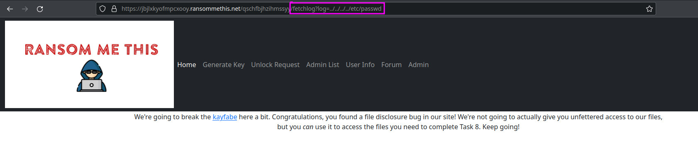

The bug can be seen in the website's source code under the `fetchlog` function.

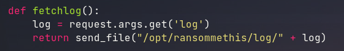

Searching in the code for `keygeneration.log` shows a function named `lock()`, which calls a binary file on the host system at `/opt/keyMaster/keyMaster`. This binary file can be leaked using the same LFI vulnerability as shown above.

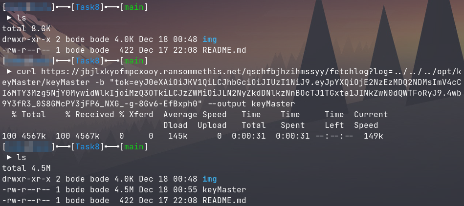

Attempting to run this binary results in a runtime error. The error message reveals that the program was written using GoLang.

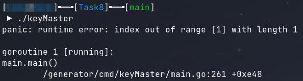

Beginning to reverse the binary in Ghidra shows that the binary has been stripped and is missing its symbols. After some research, I found a Ghidra script that can restore function names from a stripped go binary.

https://github.com/getCUJO/ThreatIntel/blob/master/Scripts/Ghidra/go_func.py

The article that I found this link from is quite interesting and worth a read.

https://cujo.com/reverse-engineering-go-binaries-with-ghidra/

After running the script, the function names of all the main class methods, as well as all other methods, are restored. However, the function names are still obfuscated, so further analysis is needed.

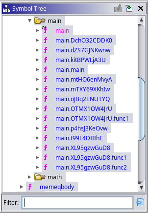

The `main.main` function is the entrypoint to the program. The function contains three main branches. These branches are presumably `lock`, `unlock`, and `credit`. The way these branches are selected is based on a value assigned for each option. I was able to find out the values associated with each option using GDB.

```
lock   = 0x6b636f6c = kcol = lock
unlock = 0x6f6c6e75 = olnu = unlo
credit = 0x64657263 = derc = cred
```

With hindsight being what it is I realized that these values are the first four letters of the command in big-endian. Knowing that the goal of the challenge is extracting the master key, it can be assumed that the focus should be on `lock` or `unlock` because it most likely uses the master key.

Note: Due to GoLang's stack-based calling convention, as well as Ghidra being a strange beast, I disabled an option in `Edit > Tool options > Decompiler > Eliminate unreachable code` to prevent Ghidra from hiding code that it believes is unreachable.

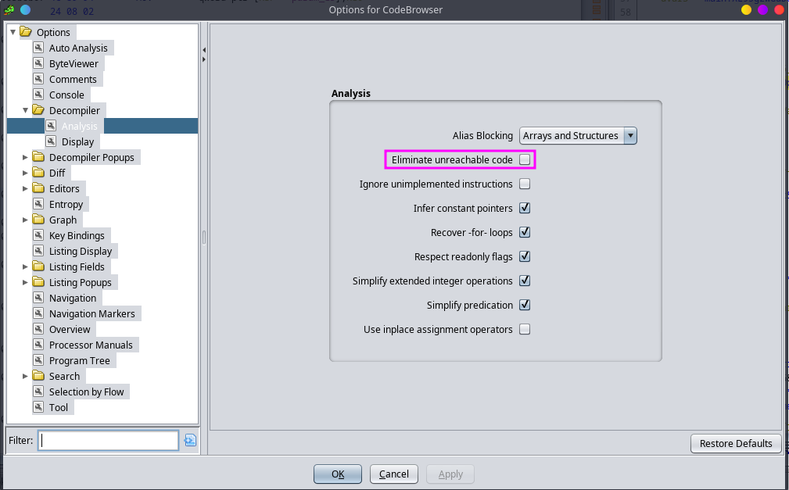

Digging through the lock branch, I found 3 different main class functions. The first function (`main.DchO32CDDK0()`) generates a time-based UUID and returns it. The second function (`main.mtHO6enMvyA()`) contains the encryption process. The third function (`main.XL95gzwGuD8()`) will place the encrypted key in the database.

1. `main.DchO32CDDK0()`

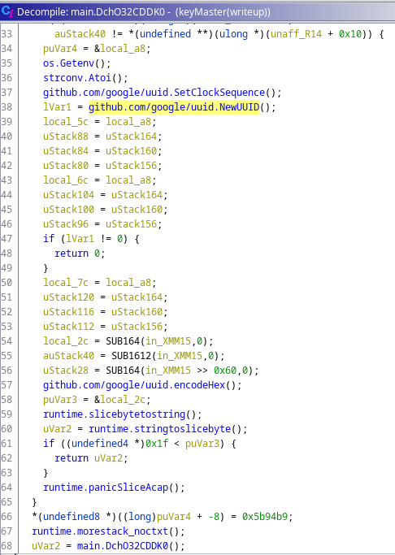

2. `main.mtHO6enMvyA()`

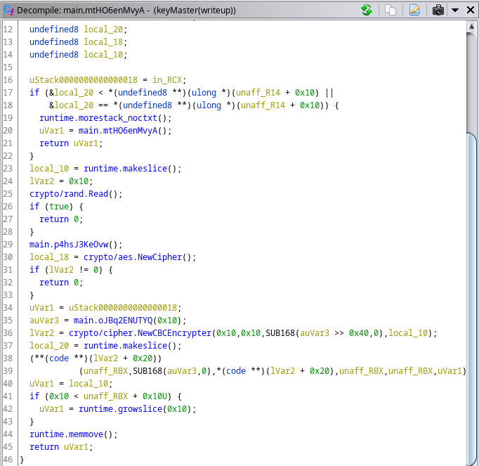

3. `main.XL95gzwGuD8()`

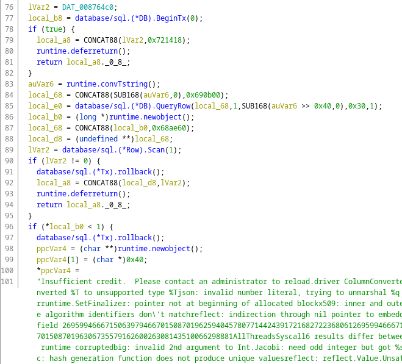

The encryption function contains processes for decrypting a master key and using it to encrypt the generated encryption key.

- Master key decryption

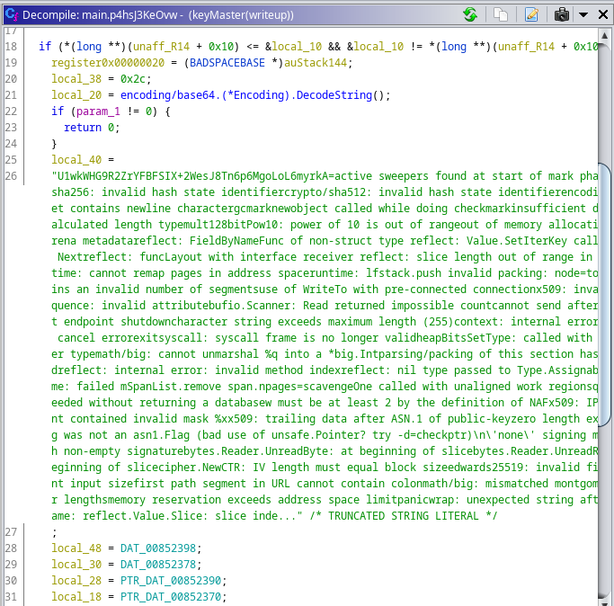

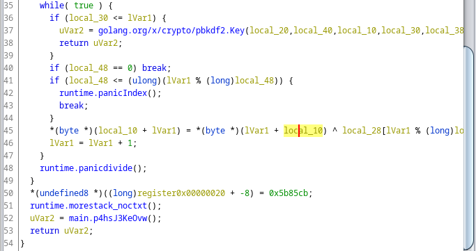

- Key encryption using the master key

`lVar2 = crypto/cipher.NewCBCEncrypter(0x10,0x10,SUB168(auVar3 >> 0x40,0),local_10);`

To extract the master key, I opened GDB and set a breakpoint at `main.p4hsJ3KeOvw()`. I then stepped to the instruction after the function return and printed out the value of `rax`.

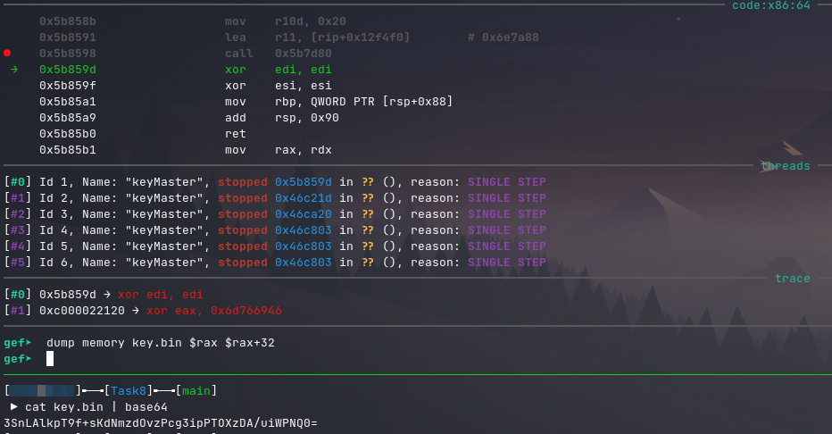

Note: The reason I know that the data is 32 bytes in length is that the value of `rsi` after the return is set to `0x20`.
