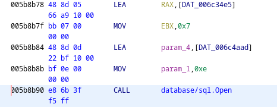
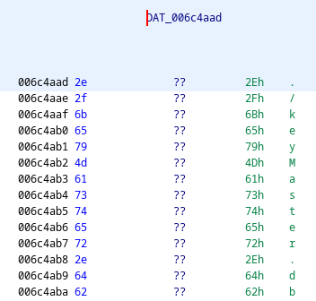
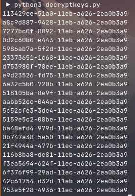
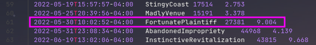
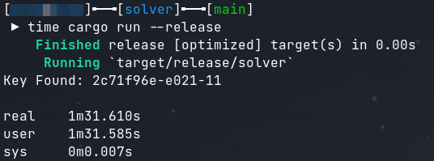
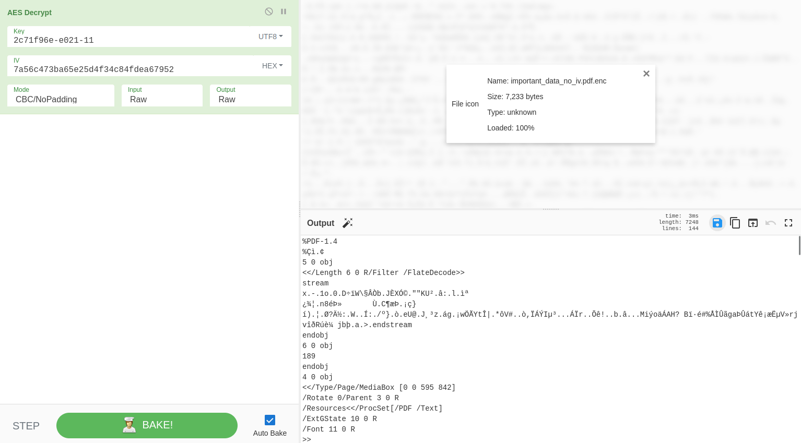
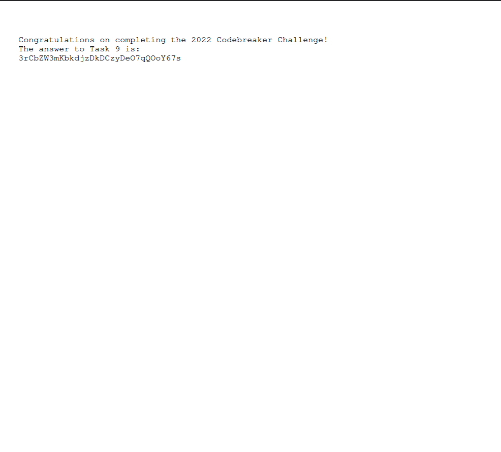

# Task 9

## Description

Unfortunately, looks like the ransomware site suffered some data loss, and doesn't have the victim's key to give back! I guess they weren't planning on returning the victims' files, even if they paid up.

There's one last shred of hope: your cryptanalysis skills. We've given you one of the encrypted files from the victim's system, which contains an important message. Find the encryption key, and recover the message.

## Solution

Funny story for this writeup. It took me 4 rewrites to get this to work in acceptable amount of time. Additionally, I started my brute force at the time stamp from the log file in task A1 rather than the intended method of using the key generation log from the website.

The first step in this challenge was more reversing of the keyMaster binary. In the third step of the lock branch, a sql connection is made. Reading the asm of the sql connection being made reveals hardcoded strings which contains the command `sqlite3` and connects to a database file called `./keyMaster.db`. This database file can be leaked using the same LFI vulnerability from task 7.





The database file contains several encrypted keys which can be decrypted using the master key. The code below is what I wrote to decrypt every key in the database.

```python
from datetime import datetime
from base64 import b64decode
from Crypto.Cipher import AES
import uuid
import sqlite3

sql = sqlite3.connect('./keyMaster.db') 
cur = sql.cursor()

keyMaster = b64decode('3SnLAlkpT9f+sKdNmzdOvzPcg3ipPTOXzDA/uiWPNQ0=')
keys = []

for row in cur.execute('SELECT encryptedKey FROM customers'):
    enc = b64decode(row[0])

    iv = enc[:16]
    data = enc[16:]

    decipher = AES.new(keyMaster, AES.MODE_CBC, iv)
    print(decipher.decrypt(data).decode('utf-8'))
    decipher = AES.new(keyMaster, AES.MODE_CBC, iv)
    keys.append(decipher.decrypt(data).decode('utf-8')[:32] + '0000')

for key in keys:
    print(key)
    key = uuid.UUID('{' + key + '}')
```



According to the keyMaster binary, these keys are version 1 UUIDs. It would also appear that over halfof the key is a constant and will not need to be bruteforced.

The next step is determining how the file is encrypted, which can be found in the tools folder from task A2.

```bash
#!/bin/sh
read -p "Enter encryption key: " key
hexkey=`echo -n $key | ./busybox xxd -p | ./busybox head -c 32`
export hexkey
./busybox find $1 -regex '.*\.\(pdf\|doc\|docx\|xls\|xlsx\|ppt\|pptx\)' -print -exec sh -c 'iv=`./openssl rand -hex 16`; echo -n $iv > $0.enc; ./openssl enc -e -aes-128-cbc -K $hexkey -iv $iv -in $0 >> $0.enc; rm $0' \{\} \; 2>/dev/null
```

This encryption script will find any file with the listed extensions, generate a random initialization vector, add the IV to the beginning of the encrypted file, and encrypt the contents of the original file using AES-128-CBC.

The last thing to understand before starting the bruteforce is how to intelligently bruteforce the key. Because this is a time based UUID, it would be sensable to figure out what time would be best to start the bruteforce. Origionally I only used the VPN log from task A1, but in this writeup I will use the better time stamp from the key generation log.



Now that I have everything, I had to infrence how the key is being used. There are 3 reasons why I was able to determine how the key was being used.

1. It would be nonsense to use a non-ascii key when the key is being passed via the command line.

2. The encryption being 128 bits is less than the length of the key in the database.

3. The `ransom.sh` script even truncaes any passed key to 16 bytes in length by converting it to hex and cutting it down to length 32.

All of this combined determines the key format needed for the bruteforce.

My first attempt at this bruteforce was a python script which was painfully slow even with 12 threads. The second attempt was in C++ until I realized it would just be easier in rust. The first attempt at solving in rust was also slow due to poor optimizations. My final iteration in rust contained decent optomization techniques.

```rust
use aes::Aes128;
use aes::cipher::KeyInit;
use aes::cipher::BlockDecrypt;
use aes::cipher::generic_array::GenericArray;

fn main() {
    let block: [u8; 16] = [0x00, 0xf0, 0x2c, 0x46, 0xd5, 0x02, 0x7a, 0x70, 0xde, 0x09, 0x29, 0x0e, 0x2f, 0x72, 0x6d, 0x05];
    let mut key: [u8; 16] = [b'c', b'b', b'8', b'9', b'7', b'0', b'0', b'0', b'-', b'e', b'0', b'2', b'0', b'-', b'1', b'1'];
    let comp: [u8; 4] = [0x5f, 0x06, 0x80, 0x35];
    let chars: [u8; 16] = [b'0', b'1', b'2', b'3', b'4', b'5', b'6', b'7', b'8', b'9', b'a', b'b', b'c', b'd', b'e', b'f'];
    let mut index: [usize; 16] = [12, 11, 8, 9, 7, 0, 0, 0, 0, 0, 0, 2, 0, 0, 0, 0];
    let mut block_copy: [u8; 16];
    let mut cipher;

    loop {
        loop {
            loop {
                loop {
                    loop {
                        loop {
                            loop {
                                loop {
                                    loop {
                                        loop {
                                            block_copy = block;
                                            
                                            cipher = Aes128::new(&GenericArray::from(key));
                                            cipher.decrypt_block((&mut block_copy).into());

                                            if block_copy[0..4] == comp {
                                                println!("Key Found: {}", std::str::from_utf8(&key).unwrap());
                                                std::process::exit(0);
                                            }

                                            index[7] = (index[7] + 1) % 16;
                                            key[7] = chars[index[7]];

                                            if key[7] == b'0' {break;}
                                        }
                                        index[6] = (index[6] + 1) % 16;
                                        key[6] = chars[index[6]];

                                        if key[6] == b'0' {break;}
                                    }
                                    index[5] = (index[5] + 1) % 16;
                                    key[5] = chars[index[5]];

                                    if key[5] == b'0' {break;}
                                }
                                index[4] = (index[4] + 1) % 16;
                                key[4] = chars[index[4]];

                                if key[4] == b'0' {break;}
                            }
                            index[3] = (index[3] + 1) % 16;
                            key[3] = chars[index[3]];

                            if key[3] == b'0' {break;}
                        }
                        index[2] = (index[2] + 1) % 16;
                        key[2] = chars[index[2]];

                        if key[2] == b'0' {break;}
                    }
                    index[1] = (index[1] + 1) % 16;
                    key[1] = chars[index[1]];

                    if key[1] == b'0' {break;}
                }
                index[0] = (index[0] + 1) % 16;
                key[0] = chars[index[0]];

                if key[0] == b'0' {break;}
            }
            index[12] = (index[12] + 1) % 16;
            key[12] = chars[index[12]];

            if key[12] == b'0' {break;}
        }
        index[11] = (index[11] + 1) % 16;
        key[11] = chars[index[11]];

        if key[11] == b'0' {break;}
    }
}
```



After retrieving the key I devrypted the file in CyberChef and was able to open the decrypted PDF.




