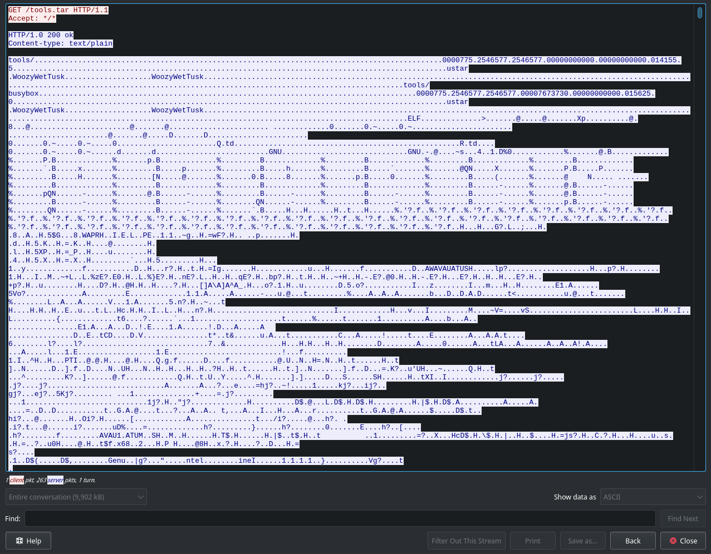

# TaskA2

## Description

Using the timestamp and IP address information from the VPN log, the FBI was able to identify a virtual server that the attacker used for staging their attack. They were able to obtain a warrant to search the server, but key files used in the attack were deleted.

Luckily, the company uses an intrusion detection system which stores packet logs. They were able to find an SSL session going to the staging server, and believe it may have been the attacker transferring over their tools.

The FBI hopes that these tools may provide a clue to the attacker's identity.

## Solution

As stated in the challenge description, the packets in `session.pcap` are encrypted and need a key to decrypt. This is where the root directory comes in.

There are two files in the `root` directory that are important. First, the `runwww.py` script sets up the transfer of files using SSL. Second, the `.cert.pem` contains the public and private keys used by `runwww.py` to encrypt and decrypt data.

The private key can be used in Wireshark to decrypt the SSL packets so they can be analyzed as plaintext.

The plaintext traffic reveals both the transferred tar file and the username of the attacker, `WoozyWetTusk`.

The data can then be downloaded as raw bytes and extracted to a tarball using `binwalk`.

