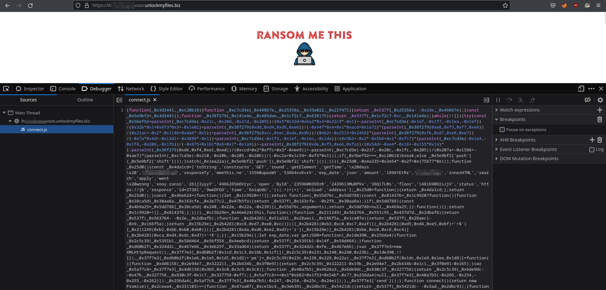

# Task B2

## Description

The attacker left a file with a ransom demand, which points to a site where they're demanding payment to release the victim's files.

We suspect that the attacker may not have been acting entirely on their own. There may be a connection between the attacker and a larger ransomware-as-a-service ring.

Analyze the demand site, and see if you can find a connection to another ransomware-related site.

## Solution

The provided file is a ransom note directing the reader to `https://ihrharfpxgvqvozv.unlockmyfiles.biz/`.

This link leads users to a ransom demand page detailing the neccessary steps to recover the encrypted data. The premise of the challenge is to find where this website is reaching to for the information displayed on this page such as time and the ransom amount. 

Opening the dev tools window shows that a JS file called `connect.js` is being used to get the neccessary information.

Unfortunatly, the JS is obfuscated and difficult to read. However, this is no issue due to the existence of the network tab in the dev tools. The network tab will show any request made by the webpage; including and request to a 3rd party service.

As shown in the dev tools, there is a 3rd party request being made to `https://jbjlxkyofmpcxooy.ransommethis.net/demand?cid=27381`. This domain is the solution to this task.

