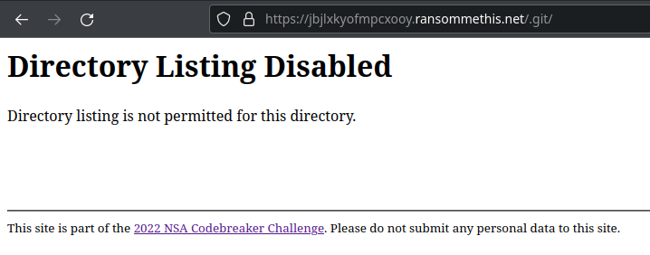
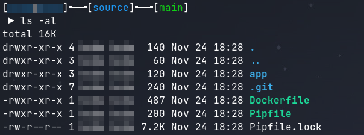
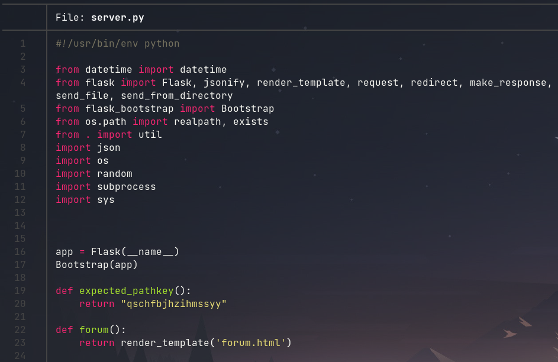
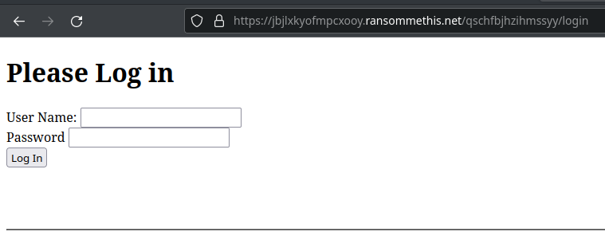

# Task B2

## Description

It looks like the backend site you discovered has some security features to prevent you from snooping. They must have hidden the login page away somewhere hard to guess.

Analyze the backend site, and find the URL to the login page.

Hint: this group seems a bit sloppy. They might be exposing more than they intend to.

## Solution 

As stated in the description there is some information leak in the website that reveals the path forward. Analyzing the request headers reveals an unusual request header `x-git-commit-hash`. This implies that the web developer was using git for version control and my have left the `.git` directory in the root of the website. This is reflected as true when querying `https://jbjlxkyofmpcxooy.ransommethis.net/.git/` which returns a 400 error instead of a 403 error.

The repository associated with this `.git` directory can be recovered by using git dumper. This tool will not only get the `.git` folder, but it will also recover all of the source code for the website.

`git-dumper https://jbjlxkyofmpcxooy.ransommethis.net/.git/ source`

The source code can now be analyzed to determine how to reach the login page for the website. While analyzing the source, it can be seen that this Python Flask web server is using a path key when checking its routes. The path key can be found in the `expected_pathkey()` function inside of `server.py`. 

Navigating to `https://jbjlxkyofmpcxooy.ransommethis.net/qschfbjhzihmssyy/login` reveals the login page and the path key `qschfbjhzihmssyy` is the solution to the challenge.

