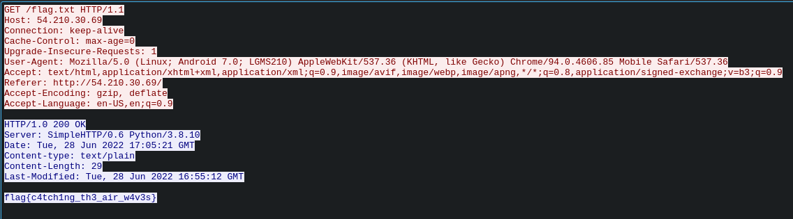

# Decaf PCAP

Author: MetaCTF

## Description

Well that's embarrassing. I tried to sniff some wireless traffic over at a coffee shop, but for some reason I can't find anything useful in it... I thought public Wi-Fi was supposed to be insecure?

Can you help me decrypt this traffic? I don't know the password, but I've heard that they switch up the last few digits of it daily.

## Solution

What makes this challenge difficult is the aspect of a custom wordlist. Using context clues, however, makes the solution quite obvious. AFAIK most establishments that I have been to use their name in the WiFi password. With that knowledge, and the contents of the challenge description, it can be assumed that the password will be the SSID of the network followed by some numbers.

Analyzing the PCAP shows that the SSID of the network is KarmaCoffee. Using this information it is possible to build a wordlist that can be used with Aircrack to decrypt the traffic.

```
$ crunch 15 15 0123456789 -t KarmaCoffee@@@@ -o wordlist.txt
Crunch will now generate the following amount of data: 160000 bytes
0 MB
0 GB
0 TB
0 PB
Crunch will now generate the following number of lines: 10000

crunch: 100% completed generating output
```

```
$ aircrack-ng -w wordlist.txt flag_decaf.pcap

Reading packets, please wait...
Opening flag_decaf.pcap
Read 142 packets.

      #  BSSID              ESSID                     Encryption
      1  6A:BD:C5:12:38:0B  KarmaCoffee               WPA (1 handshake)

      Choosing first network as target.

      Reading packets, please wait...
      Opening flag_decaf.pcap
      Read 142 packets.

      1 potential targets

                                      Aircrack-ng 1.7

            [00:00:01] 8328/10000 keys tested (13922.02 k/s)

            Time left: 0 seconds                                      83.28%

                              KEY FOUND! [ KarmaCoffee1424 ]
                              
            
            Master Key     : DD 3C 4A 3F 8E FC 27 6B 99 9B 07 2D F0 7C C5 C1
                             BA B1 83 D2 CF A7 F7 5A CB CB 24 D1 3D 8C 8B 32

            Transient Key  : 6E FB 09 9A 6B AE 4A 97 BA 24 60 AD 85 A0 C1 B4
                             5B 67 02 AA 9F 8E A7 60 B2 D1 5A CB 5A 87 B5 DB
                             97 31 8E 10 7A 11 68 0A 44 FF 56 AD 48 E7 27 64
                             9F C6 8E 54 FB C0 D5 59 68 5B 5B 90 C9 1A D8 D4

            EAPOL HMAC     : 0F DF 2E DE 8D 55 C1 5D A1 0B B3 D9 C8 F0 0B 0A
```



