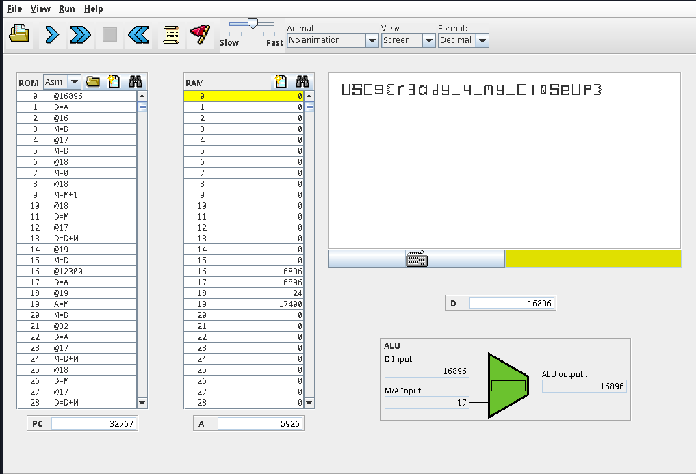

# from Nand to Tetris to the big screen 

Author: DrB Hacking

## Description

We recovered this rom image which I'm told has A instructions and C instructions, whatever that means... Can you see anything useful here?

## Solution

Using the context clues in the challenge it is possible to determine that this challenge is a reference to [From Nand to Tetris](https://www.nand2tetris.org/). Using this information it is possible to find the specification for the assembly language as well as the tools neccesarry to execute the assembly code.

[Software](https://www.nand2tetris.org/software)

[Language Specification](https://www.cs.huji.ac.il/course/2002/nand2tet/oldsite/docs/ch_5_assembler.pdf)

Using the information in the language specification a disasembler can be written in python to turn the binary file back into Hack assembly which can be executed in the CPU Emulator tool.



```python
#!/usr/bin/python3

import struct

a0 = {
    "101010": "0",
    "111111": "1",
    "111010": "-1",
    "001100": "D",
    "110000": "A",
    "001101": "!D",
    "110001": "!A",
    "001111": "-D",
    "110011": "-A",
    "011111": "D+1",
    "110111": "A+1",
    "001110": "D-1",
    "110010": "A-1",
    "000010": "D+A",
    "010000": "D-A",
    "000111": "A-D",
    "000000": "D&A",
    "010101": "D|A",
}

a1 = {
    "010101": "D|M",
    "000000": "D&M",
    "000111": "M-D",
    "010011": "D-M",
    "000010": "D+M",
    "110010": "M-1",
    "110111": "M+1",
    "110011": "-M",
    "110001": "!M",
    "110000": "M"

}

dest_val = {
    "000": "",
    "001": "M",
    "010": "D",
    "011": "MD",
    "100": "A",
    "101": "AM",
    "110": "AD",
    "111": "AMD"
}

jmp_val = {
    "000": "",
    "001": "JGT",
    "010": "JEQ",
    "011": "JGE",
    "100": "JLT",
    "101": "JNE",
    "110": "JLE",
    "111": "JMP"
}

f = open('n2t-rom.bin', 'rb')

filecontent = f.read()
filecontent = '0' + bin(int.from_bytes(filecontent, "big"))[2:]

instructions = [filecontent[i:i+16] for i in range(0, len(filecontent), 16)]

count = 0
for instr in instructions:
    if instr[0] == '0':
        addr = instr[1:]
        print('@'+str(int(addr,2)))
    elif instr[0] == '1':
        a = instr[3]
        ALU = instr[4:10]
        dest = instr[10:13]
        jmp = instr[13:]
        
        if a == "0":
            if dest_val[dest] == '' and jmp_val[jmp] == '':
                print("{}".format(a0[ALU]))
            elif dest_val[dest] == '':
                instruction = "{};{}".format(a0[ALU], jmp_val[jmp])
                if instruction == '0;JMP':
                    continue
                else:
                    print(instruction)
            elif jmp_val[jmp] == '':
                print("{}={}".format(dest_val[dest], a0[ALU]))
            else:
                print("{}={};{}".format(dest_val[dest], a0[ALU], jmp_val[jmp]))
        if a == "1":
            if dest_val[dest] == '' and jmp_val[jmp] == '':
                print("{}".format(a1[ALU]))
            elif dest_val[dest] == '':
                instruction = "{};{}".format(a1[ALU], jmp_val[jmp])
                if instruction == '0;JMP':
                    continue
                else:
                    print(instruction)
            elif jmp_val[jmp] == '':
                print("{}={}".format(dest_val[dest], a1[ALU]))
            else:
                print("{}={};{}".format(dest_val[dest], a1[ALU], jmp_val[jmp]))
    count += 1
```

