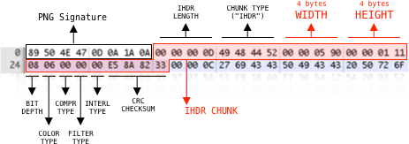
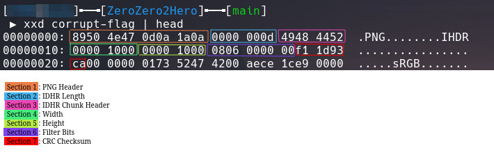

# ZeroZero2H3r0

Author: V10l3nt

## Description

Recover and capture the flag.

## Solution

The provided file is given without an extension, so the `file` command can be used to determine the file type.

```
$ file corrupt-flag
corrupt-flag: PNG image data, 0 x 0, 8-bit/color RGBA, non-interlaced
```

Attempting to open this PNG results in a format error. To determine what the error is `pngcheck` can be used to find the issue.

```
$ pngcheck corrupt-flag
corrupt-flag  invalid IHDR image dimensions (0x0)
ERROR: corrupt-flag
```

Looking up the specifications for PNG IDHR sections shows that the the demensions are specified in the IDHR section and this diagram can be compared to our own file using xxd to get a hexdump of the file.



```
$ xxd corrupt-flag | head
00000000: 8950 4e47 0d0a 1a0a 0000 000d 4948 4452  .PNG........IHDR
00000010: 0000 0000 0000 0000 0806 0000 00f1 1d93  ................
00000020: ca00 0000 0173 5247 4200 aece 1ce9 0000  .....sRGB.......
00000030: 0090 6558 4966 4d4d 002a 0000 0008 0006  ..eXIfMM.*......
00000040: 0106 0003 0000 0001 0002 0000 0112 0003  ................
00000050: 0000 0001 0001 0000 011a 0005 0000 0001  ................
00000060: 0000 0056 011b 0005 0000 0001 0000 005e  ...V...........^
00000070: 0128 0003 0000 0001 0002 0000 8769 0004  .(...........i..
00000080: 0000 0001 0000 0066 0000 0000 0000 0048  .......f.......H
00000090: 0000 0001 0000 0048 0000 0001 0003 a001  .......H........
```

As seen, our file currently has the demesions set to 0x0 which is reflected by PNG check. It is possible to change this value using a hex editor which is what I tried next.

```
$ xxd corrupt-flag | head | copy
00000000: 8950 4e47 0d0a 1a0a 0000 000d 4948 4452  .PNG........IHDR
00000010: 0000 1000 0000 1000 0806 0000 00f1 1d93  ................
00000020: ca00 0000 0173 5247 4200 aece 1ce9 0000  .....sRGB.......
00000030: 0090 6558 4966 4d4d 002a 0000 0008 0006  ..eXIfMM.*......
00000040: 0106 0003 0000 0001 0002 0000 0112 0003  ................
00000050: 0000 0001 0001 0000 011a 0005 0000 0001  ................
00000060: 0000 0056 011b 0005 0000 0001 0000 005e  ...V...........^
00000070: 0128 0003 0000 0001 0002 0000 8769 0004  .(...........i..
00000080: 0000 0001 0000 0066 0000 0000 0000 0048  .......f.......H
00000090: 0000 0001 0000 0048 0000 0001 0003 a001  .......H........
```

Patching the file and running `pngcheck` again now shows another issue which means that we are on the right track.

```
$ pngcheck corrupt-flag | copy
corrupt-flag  CRC error in chunk IHDR (computed f2a32417, expected f11d93ca)
ERROR: corrupt-flag
```

The error shows that the CRC Checksum in the file as shown below does not match the checksum calculated with the data currently in the IDHR section. Using this information it can be determined that the correct demensions need to be used in the IDHR section to get the CRC to match and make the PNG file valid.



The script below will brute force the correct dimensions and print the correct dimensions once the given CRC Checksum matches the calculated version. These dimensions can then be patched into the file allowing the image to be opened properly without errors.

```python
#!/usr/bin/env python3

from pwn import p32
from zlib import crc32


required_crc = 0xF11D93CA
max_dimension = 4000

for width in range(0, max_dimension):
    for height in range(0, max_dimension):
        ihdr = b'\x49\x48\x44\x52' + p32(width, endian='big') + p32(height, endian='big') + b'\x08\x06\x00\x00\x00'
        
        if height % 100 == 0:
            print('ihdr:', ihdr.hex())
        
        crc = crc32(ihdr)
        if crc == required_crc:
            print('FOUND!')
            print(width, height)
            exit()

```

