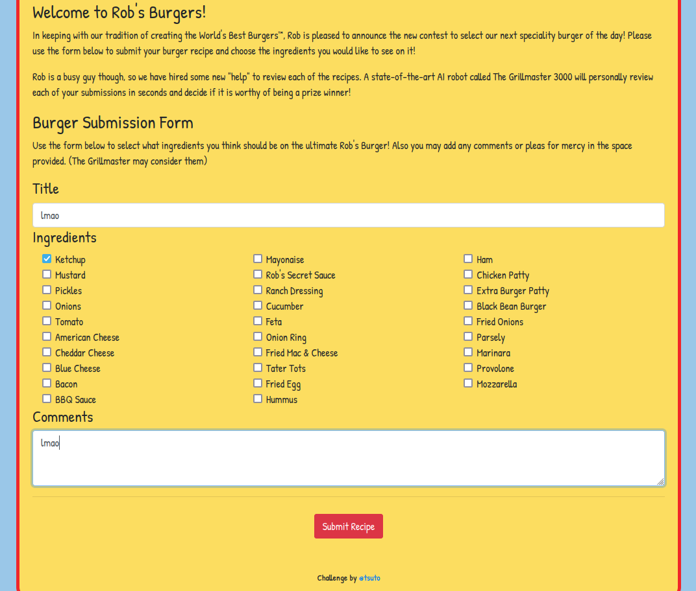
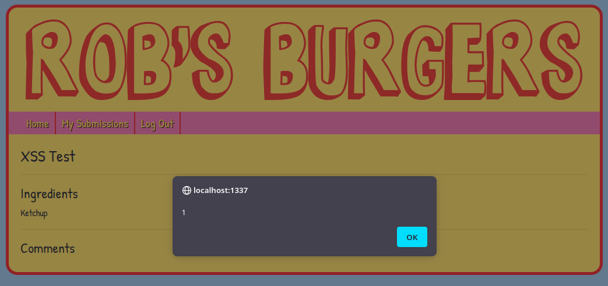
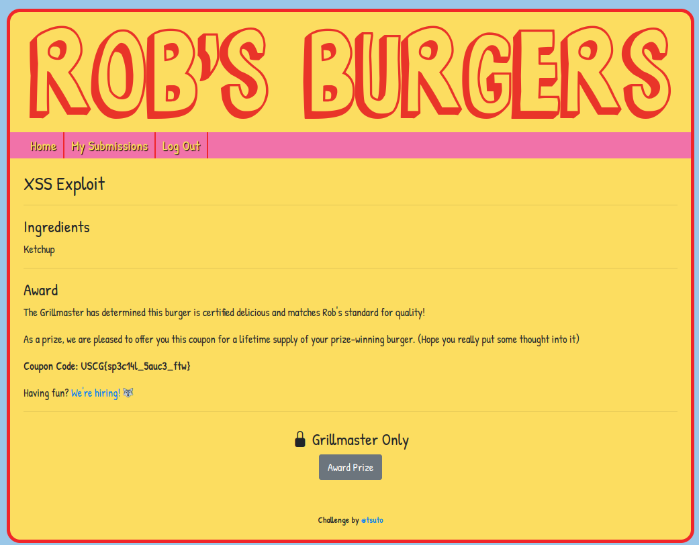

# Grillmaster

Author: Tsuto

## Description

A burger shop is accepting entries for its new menu. Users can select the ingredients they would like to see on a recipe and submit it. Then, a state-of-the-art AI called "The Grillmaster" will review each one and determine if it sounds delicious enough. The best recipe gets a special prize!

## Solution

This web app allows users to submit a burger to be reviewed by the sites administrator. There are 3 different sections:

1. The title
2. The ingrdients
3. The comment

The commend form is vulnerable to XSS and allows for any HTML tags to be injected including ``

At the bottom of the page there is a button that will award the prize, but it only works for "The Grillmaster". When a sumbmission is completed, there is a message at the top of the screen that states "The Grillmaster is evaluating your recipe". This implies that all xss attacks are rendered by the Grillmaster. Using the payload `` will force the Grillmaster to approve the recipe when the page is rendered.

Flag: `USCG{sp3c14l_5auc3_ftw}`
