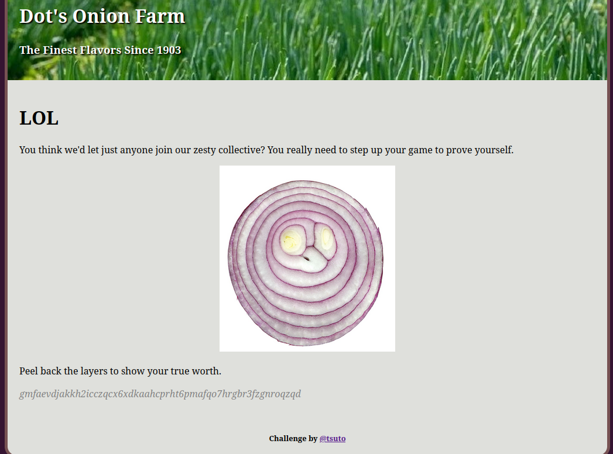
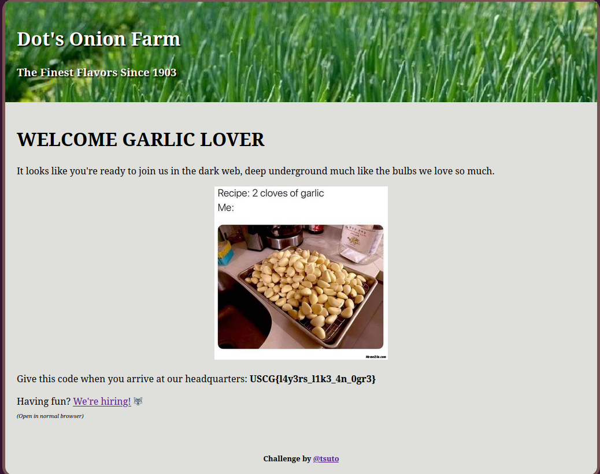

# Layers

Author: Tsuto

## Description

The website for Dot's Onion Farm has been hacked and defaced by a malicious group espousing the supremacy of garlic over onions as a cooking ingredient.

## Solution

The defaced homepage of the website contains a link to `/join` which contains a strange base64 string.

Based on the hints in the challenge, such as "Dot's Onion", it can be assumed that this is an onion link. Setting up a tor proxy and going to `https://www.gmfaevdjakkh2icczqcx6xdkaahcprht6pmafqo7hrgbr3fzgnroqzqd.onion/join` give us the flag.

Flag: `USCG{l4y3rs_l1k3_4n_0gr3`
