# Hack The Box: Shibboleth (Medium)

<p align="center";>
    
</p>

## Quick Summary:

This week's Writeup will be for Shibboleth. This was enjoyable box despite some troubles with the IPMI exploits. This is a Linux box and the machine IP is `10.10.11.124`. Last step before I start is to add `shibboleth.htb` to `/etc/hosts`.

## Nmap:

As always we will start with some simple `nmap` scans.

```
Full TCP scan with default scripts and default enumeration

# Nmap 7.92 scan initiated Thu Feb 10 16:14:07 2022 as: nmap -sC -sV -p- --min-rate 5000 -o nmap/full-TCP.scan 10.10.11.124
Nmap scan report for 10.10.11.124
Host is up (0.091s latency).
Not shown: 65474 filtered tcp ports (no-response), 60 closed tcp ports (conn-refused)
PORT   STATE SERVICE    VERSION
80/tcp open  tcpwrapped
|_http-server-header: Apache/2.4.41 (Ubuntu)

Service detection performed. Please report any incorrect results at https://nmap.org/submit/
# Nmap done at Thu Feb 10 16:15:01 2022 -- 1 IP address (1 host up) scanned in 54.23 seconds
```

```
Full basic UDP scan

# Nmap 7.92 scan initiated Sat Feb 12 14:02:29 2022 as: nmap -sU --min-rate 10000 -oN nmap/full-UDP.scan 10.10.11.124
Warning: 10.10.11.124 giving up on port because retransmission cap hit (10).
Nmap scan report for shibboleth.htb (10.10.11.124)
Host is up (0.30s latency).
Not shown: 978 open|filtered udp ports (no-response)
PORT      STATE  SERVICE
162/udp   closed snmptrap
623/udp   open   asf-rmcp
657/udp   closed rmc
1024/udp  closed unknown
1043/udp  closed boinc
1060/udp  closed polestar
4666/udp  closed edonkey
6004/udp  closed X11:4
17989/udp closed unknown
19193/udp closed unknown
20449/udp closed unknown
25931/udp closed unknown
28465/udp closed unknown
29256/udp closed unknown
30303/udp closed unknown
30544/udp closed unknown
37212/udp closed unknown
40866/udp closed unknown
44190/udp closed unknown
47772/udp closed unknown
49167/udp closed unknown
49170/udp closed unknown

# Nmap done at Sat Feb 12 14:02:45 2022 -- 1 IP address (1 host up) scanned in 16.16 seconds
```

```
# Nmap 7.92 scan initiated Sat Feb 12 14:03:27 2022 as: nmap -sC -sV -sU -p 623 --min-rate 10000 -oN nmap/623-UDP.scan 10.10.11.124
Nmap scan report for shibboleth.htb (10.10.11.124)
Host is up (0.040s latency).

PORT    STATE SERVICE  VERSION
623/udp open  asf-rmcp
1 service unrecognized despite returning data. If you know the service/version, please submit the following fingerprint at https://nmap.org/cgi-bin/submit.cgi?new-service :
SF-Port623-UDP:V=7.92%I=7%D=2/12%Time=62081295%P=x86_64-pc-linux-gnu%r(ipm
SF:i-rmcp,1E,"\x06\0\xff\x07\0\0\0\0\0\0\0\0\0\x10\x81\x1cc\x20\x008\0\x01
SF:\x97\x04\x03\0\0\0\0\t");

Service detection performed. Please report any incorrect results at https://nmap.org/submit/ .
# Nmap done at Sat Feb 12 14:03:33 2022 -- 1 IP address (1 host up) scanned in 5.90 seconds
```

As shown in the scans we only have 2 ports open `80/tcp` and `623/udp`.

## Web Enumeration:

`http://shibboleth.htb`

<p align="left";>
    
</p>

Looking around the home page, it looks as if this is just a template and won't get us much information. However, I did a gobuster scan on it just in case.

```
/assets               (Status: 301) [Size: 317] [--> http://shibboleth.htb/assets/]
/forms                (Status: 301) [Size: 316] [--> http://shibboleth.htb/forms/]
/server-status        (Status: 403) [Size: 279]
```

As we can see there isn't much here and looking into these directories doesn't provide much information.

The next step would be to look into vhost scanning which does produce some useful results.

```
Found: monitoring.shibboleth.htb (Status: 200) [Size: 3686]
Found: zabbix.shibboleth.htb (Status: 200) [Size: 3686]
Found: monitor.shibboleth.htb (Status: 200) [Size: 3686]
```

Navigating to all of these web pages provides the same login fourm and the directory scans also returned the same information.

<p align="left";>
    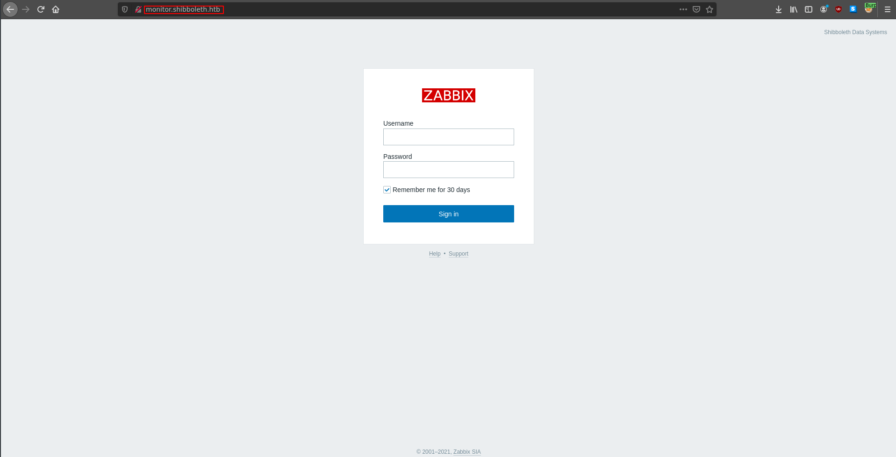
</p>

```
/modules              (Status: 301) [Size: 334] [--> http://monitor.shibboleth.htb/modules/]
/js                   (Status: 301) [Size: 329] [--> http://monitor.shibboleth.htb/js/]
/templates.php        (Status: 200) [Size: 1832]
/include              (Status: 301) [Size: 334] [--> http://monitor.shibboleth.htb/include/]
/assets               (Status: 301) [Size: 333] [--> http://monitor.shibboleth.htb/assets/]
/app                  (Status: 301) [Size: 330] [--> http://monitor.shibboleth.htb/app/]
/services.php         (Status: 200) [Size: 1831]
/image.php            (Status: 200) [Size: 1828]
/index.php            (Status: 200) [Size: 3686]
/fonts                (Status: 301) [Size: 332] [--> http://monitor.shibboleth.htb/fonts/]
/audio                (Status: 301) [Size: 332] [--> http://monitor.shibboleth.htb/audio/]
/conf                 (Status: 301) [Size: 331] [--> http://monitor.shibboleth.htb/conf/]
/map.php              (Status: 200) [Size: 1826]
/setup.php            (Status: 200) [Size: 1828]
/local                (Status: 301) [Size: 332] [--> http://monitor.shibboleth.htb/local/]
/history.php          (Status: 200) [Size: 1830]
/maintenance.php      (Status: 200) [Size: 1834]
/applications.php     (Status: 200) [Size: 1835]
/locale               (Status: 301) [Size: 333] [--> http://monitor.shibboleth.htb/locale/]
/items.php            (Status: 200) [Size: 1828]
/vendor               (Status: 301) [Size: 333] [--> http://monitor.shibboleth.htb/vendor/]
/slides.php           (Status: 200) [Size: 1829]
/chart.php            (Status: 200) [Size: 1828]
/graphs.php           (Status: 200) [Size: 1829]
/overview.php         (Status: 200) [Size: 1831]
/screens.php          (Status: 200) [Size: 1830]
/server-status        (Status: 403) [Size: 287]
/hosts.php            (Status: 200) [Size: 1828]
/queue.php            (Status: 200) [Size: 1828]
/triggers.php         (Status: 200) [Size: 1831]
/report2.php          (Status: 200) [Size: 1830]
```

Looking through these directories return no useful information. Time to look elsewhere.

## IPMI Exploit:

Now that we are back to the drawing board, we can look into that one open UDP port (623/udp).  

```
# Nmap 7.92 scan initiated Sat Feb 12 14:03:27 2022 as: nmap -sC -sV -sU -p 623 --min-rate 10000 -oN nmap/623-UDP.scan 10.10.11.124
Nmap scan report for shibboleth.htb (10.10.11.124)
Host is up (0.040s latency).

PORT    STATE SERVICE  VERSION
623/udp open  asf-rmcp
1 service unrecognized despite returning data. If you know the service/version, please submit the following fingerprint at https://nmap.org/cgi-bin/submit.cgi?new-service :
SF-Port623-UDP:V=7.92%I=7%D=2/12%Time=62081295%P=x86_64-pc-linux-gnu%r(ipm
SF:i-rmcp,1E,"\x06\0\xff\x07\0\0\0\0\0\0\0\0\0\x10\x81\x1cc\x20\x008\0\x01
SF:\x97\x04\x03\0\0\0\0\t");

Service detection performed. Please report any incorrect results at https://nmap.org/submit/ .
# Nmap done at Sat Feb 12 14:03:33 2022 -- 1 IP address (1 host up) scanned in 5.90 seconds
```

looking into this port a little more reveals that there are some common vulnerable sevices that run on it such as IMPI. For more information you can look into this article: `https://book.hacktricks.xyz/pentesting/623-udp-ipmi`

The article shows some exploits in metasploit, so to metasploit we go.

<p align="left";>
    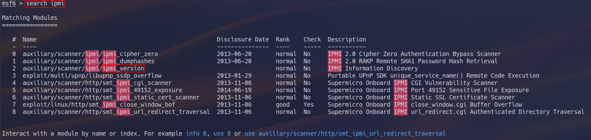
</p>

using the scanner tool from the auxillary module reveals that the machine is running IPMI 2.0 which is vulnerable to the cipher zero attack and the hash dump attack.

<p align="left";>
    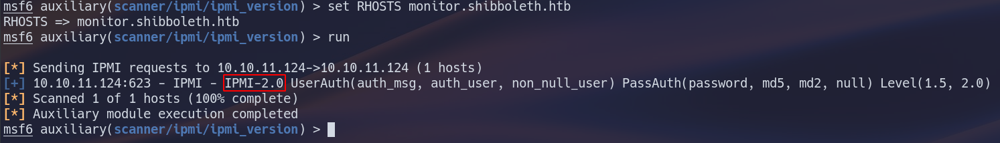
</p>

Running the cipher zero auth bypass scanner doesn't return good results so we can try the hash retrieval scanner which does give us a valid hash.

<p align="left";>
    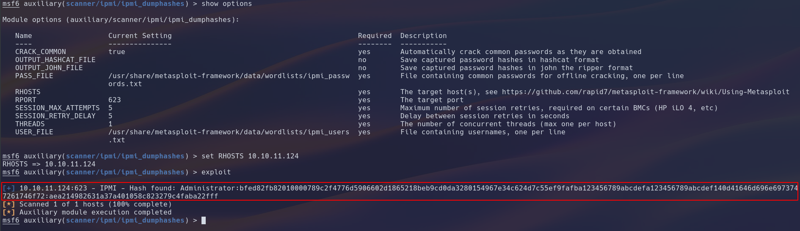
</p>

After looking through the hashcat man page I found a hash type specifically for IPMI 2.0 which is mode 7300

```
7300 | IPMI2 RAKP HMAC-SHA1                             | Network Protocols
```

After running hashcat with rockyou I was able to crack the password.

```
username: Administrator
password: ilovepumkinpie1
```

The only possible place to use login credintials is currently the vhost login panel. These are the credentials for the user Administrator on the vhost login form.

## Exploiting the Admin Panel:

After logging in with our leaked credintials, we can start to look for a way to get a shell on the system.

<p align="left";>
    
</p>

The exploit I found that works didn't have much information, but I was able to recreate it. CVE info: `https://cve.mitre.org/cgi-bin/cvename.cgi?name=CVE-2021-46088`.

This RCE vulnerability will use the custom script feature on Zabbix to run commands on the system.

<p align="left";>
    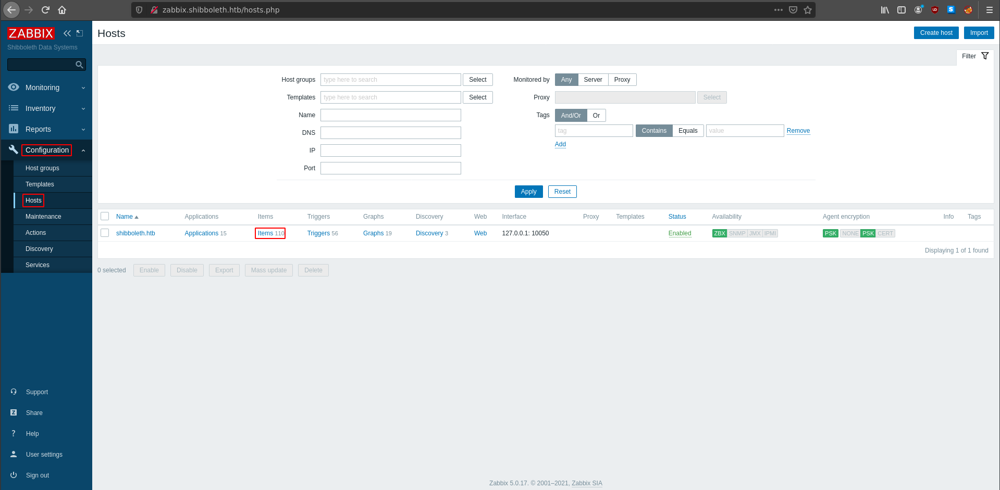
</p>

<p align="left";>
    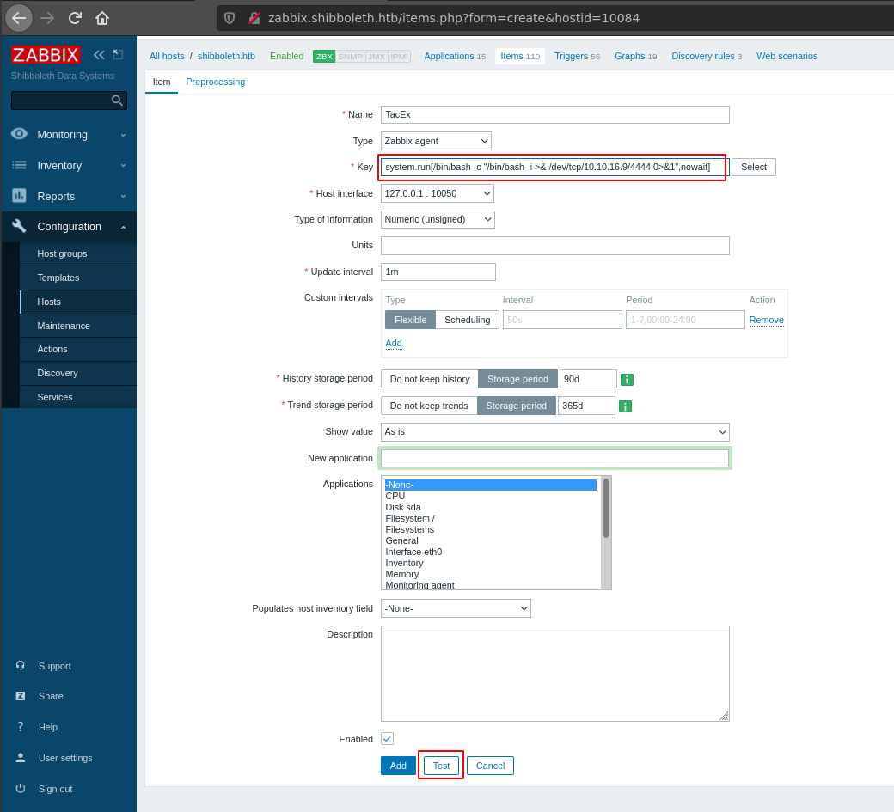
</p>

Hitting the test button, will run the reverse shell command and give us a shell on our port listener.

<p align="left";>
    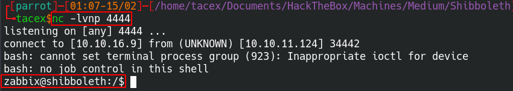
</p>

## Escalation to User:

The first step that I normally start with is to look into running processes listening ports, and what users are on the system.

Looking at processes and listening ports didn't give much information, however the `/etc/passwd` file shows and extra user on the system that contains the user flag.

<p align="left";>
    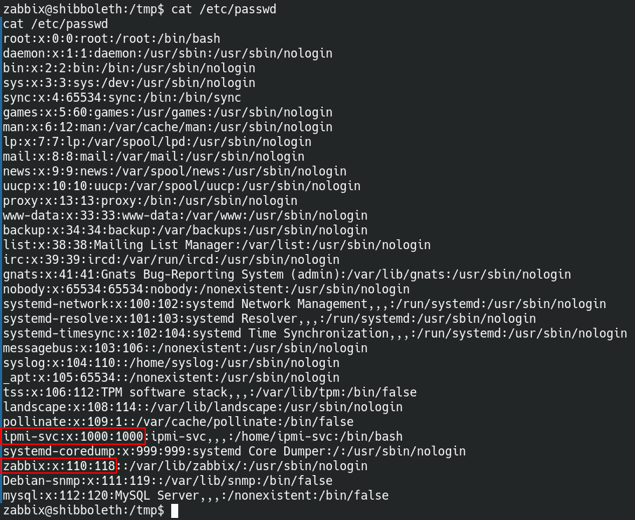
</p>

I could not find any information through basic system enumeration and decided to take a break. When I did get back into it I decided to try password reuse because why not.

<p align="left";>
    
</p>

The fact that this worked made me a little sad because I spent way to much time on this.

## Exploiting MariaDB for Root:

Now that we have user access we can work on getting root.

Looking at running processes shows that there is an SQL server running on the system. Using the credintials we currently have does not work, so we need to look further.

<p align="left";>
    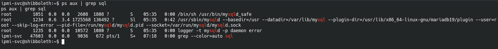
</p>

Running LinPEAS on the system reveals some credintials for an SQL database that is running as root.

<p align="left";>
    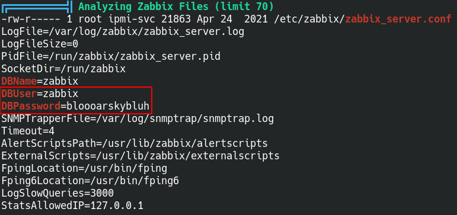
</p>

Using the credentials to login to the SQL server allows us to poke around and look for more information.

<p align="left";>
    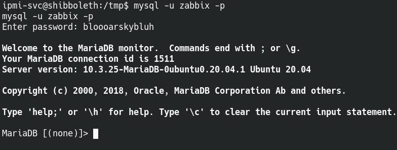
</p>

There are two databases that we can look into for more potential cerdintials.

<p align="left";>
    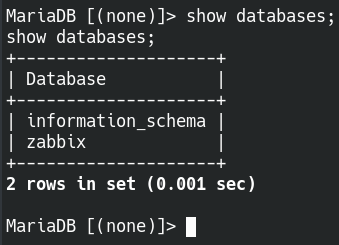
</p>

With some digging I was able to find a users table that provided some password hashes but they did not look very promising.

<p align="left";>
    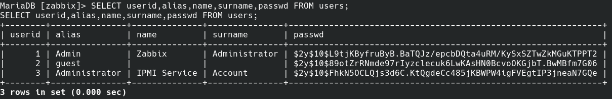
</p>

I decided that rather than trying to crack these passwords I would try to look for another way to root. 

Back when I logged into the SQL database it showed a version for the MariaDB server. I decided to try to look for exploits and I was able to find an exploit for this version.

More information on the exploit can be found here: `https://github.com/Al1ex/CVE-2021-27928`

<p align="left";>
    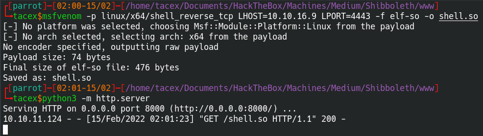
</p>

After creating the exploit with msfvenom, we can move to the machine and use `wget` to download the exploit to `/tmp`

<p align="left";>
    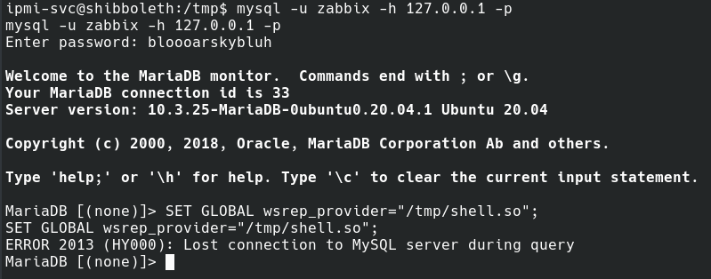
</p>

Now we can start the exploit by setting the `wsrep_provider` global variable to the exploit binary.

<p align="left";>
    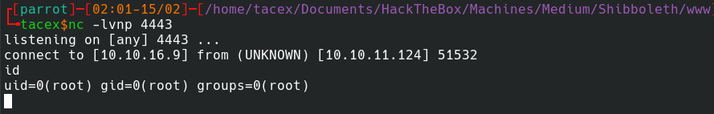
</p>

Once the exploit runs, we have a root shell and have completed the box.

<p align="center";>
    
</p>
